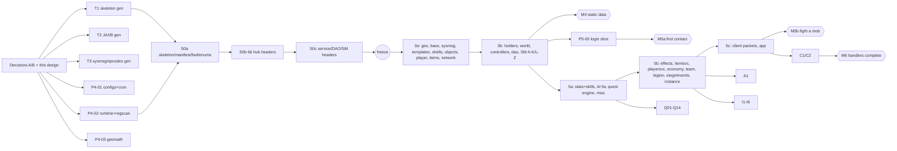

# Handler registration and porting plan (phases 4-6)

> **Status:** accepted with the amendments at the end of this document (free-threaded runtime D1, reload deferred D3, 4-6 agents per wave D4), 2026-09-13.

## Summary

Handler registration: each handler .cpp ends with a one-line marker (AION_AI, AION_INSTANCE_HANDLER, AION_ZONE_HANDLER, AION_QUEST_HANDLER, AION_ADMIN/PLAYER/CONSOLE_COMMAND). The marker expands to a concept-checked factory function with external linkage. A small C++ build tool (aion_gs_regscan) scans the ported sources on every build and writes constinit registry tables: {key, Java-style class name, factory pointer, source}. The same tool also writes the client packet table (AION_CLIENT_PACKET) and the handler npc-id set that replaces QuestSpawnAnalyzer's regex scan of .java files. Because the tables reference every factory symbol, static libraries need no /WHOLEARCHIVE and nothing depends on static-init order. Duplicates fail the build. Engines call the factories only in GameServer::main, after config and static data have loaded. Quests and commands are singletons, while AIs, instance handlers and zone handlers get a new instance for each owner. AIs are created by a VisibleObject::create<T>() two-phase factory (passkey constructors). Its postConstruct step creates the AI first and then runs the rest of the Java constructor-body initialisation, so Java's order is kept exactly. I checked that none of the 461 AI constructors depends on the difference. Reflective commands get explicit replacements: a named config field registry, Creature::replaceAi that keeps retired AIs alive, a NioServer connection snapshot, and a java.awt.Color constant table. Handler libraries use per-category PCH plus unity builds; file-scope rules make handlers unity-safe by construction.
Porting order:
1. Foundations that need no spine (configs+cron, runtime, geo math, generators).
2. A three-step spine. S0a is mechanical: the tree, the chunk manifest with every library target, forward headers for all 2,310 classes, enums, AION_UNPORTED and the registry infrastructure. S0b holds about 66 hand-reviewed hub headers, including the handler-facing base APIs. S0c holds generated declaration headers for 136 services, 56 DAOs and 237 server packets. Every declaration gets a stub body in its owner's directory, so the whole server links from day one.
3. Phase-4 chunks (17), then Phase-5 chunks (18, including a vertical login slice), then Phase-6 handler chunks (23).
Each chunk gets its own static library target. Ownership is decided per file by a configure-time-checked manifest.
Milestones: M4 means all static data and geo load with counts matching an independent Python oracle. M5a ('first contact') means the real client logs in, creates a character, enters Poeta/Ishalgen and sees the spawns, first through an automated FakeGameClient scenario and then the real client. Verification relies on count oracles, Java/C++ structural parity diffs (packet write/read sequences, DAO SQL literals, handler literals and API calls, spawn ids), a deterministic manual-clock harness, ASan lifetime smoke runs over every handler, and UNPORTED-hit tracing.

# Handler registration and porting partition for the C++ game server (phases 4-6)

This design builds on decision A (threading, ownership, scheduler) and decision B (static data code shape). Where it depends on them, the dependency is marked **[A]** or **[B]**. Nothing here requires a specific outcome of those decisions: the registry only needs "a factory taking a borrowed owner reference". The partition only needs A and B to be frozen before the spine step starts.

Numbers were checked against the sources for this design:
- AI constructors: 460 take `Npc` and 1 takes `Summon`. 8 have bodies beyond `super(owner)`, and none of them touches state that Java initialises after `super()`.
- Handler classes used as base classes: 50 (ai 34, instance 15, zone 1). 40 of them are also registered.
- Cross-category handler imports exist only between admincommands and consolecommands (7 imports, including a cycle RemoveCd ↔ Clearusercoolt).
- Quest ids: 1,030 literal `super(<id>)` calls, all equal to the class-name digits, plus 5 `_questId` constants. 1 constructor has extra statements.
- Keyword clashes: `register()` is declared 1,074 times and `delete()` is called 401 times, and package `questEngine.handlers.template` is a keyword.
- The class-level dependency graph from the research was re-partitioned with the chunk rules below. The line counts in the tables come from that run.

---

## 1. Handler registration

### 1.1 Decision

**One-line marker macro per handler, plus registry tables generated on every build by a C++ build tool (`aion_gs_regscan`).**

Rejected alternatives:
- **Self-registering static objects.** MSVC drops unreferenced `.obj` files from STATIC libraries, so this needs `/WHOLEARCHIVE` on the server and on every test exe. The init order is unspecified. Registrars would run before `Logging::init` and before config and static data exist. Duplicate names would only show up at runtime.
- **A hand-maintained list.** It gets about 1,700 lines of churn during phase 6, and parallel agents would conflict on one shared file.
- **A committed generated table.** Same merge-conflict problem.

The build-time table is not committed. Agents that work in disjoint directories never touch a shared file.

### 1.2 Source layout, namespaces, file rules

```
cpp/game-server/
  CMakeLists.txt
  chunks.cmake                        # ownership manifest: every chunk → globs → library target (the only shared build file, owned by the integrator)
  src/aion/gameserver/...             # core, mirrors game-server/src/com/aionemu/gameserver (CONVENTIONS)
  src/aion/gameserver/handlers/HandlerRegistry.h   # markers, entry structs, concepts (core, not a handler)
  handlers/aion/gameserver/handlers/  # mirrors game-server/data/handlers/<package>
      ai/  AiPrelude.h  AggressiveNpcAI.h/.cpp  GeneralNpcAI.cpp ...  instance/darkPoeta/CalindiFlamelordAI.cpp ...
      instance/  InstancePrelude.h  ...
      quest/  QuestPrelude.h  heiron/_1500OrdersFromPerento.cpp ...
      zone/  ZonePrelude.h  _1012SensoryArea.cpp  pvpZones/PvPZone.h/.cpp  pvpZones/PvPAreaZone.cpp
      admincommands/AdminCommandsPrelude.h  playercommands/PlayerCommandsPrelude.h  consolecommands/ConsoleCommandsPrelude.h
      CommandPrelude.h                  # only the PCH of aion_gs_handlers_commands: includes the three command preludes, declares nothing
  generated/                          # committed outputs of the Python generators (JAXB [B], sysmsg, DialogAction, opcode tables)
  tools/regscan/                      # aion_gs_regscan (C++23, no dependencies)
  tools/gen/  tools/oracle/  tools/parity/  tools/porting/   # Python, run by hand or by ctest; never needed to build the server
  tests/<chunk>/...   tests/support/ (FakeGameClient, test DB, harness)
```

- Include root is `cpp/game-server/handlers`, so includes read `#include "aion/gameserver/handlers/ai/AggressiveNpcAI.h"`, like the rest of the port.
- Namespaces mirror the Java packages under `aion::gameserver::handlers`, e.g. `aion::gameserver::handlers::ai::instance::darkPoeta`. This keeps the duplicate simple names apart (CalindiFlamelordAI, PadmarashkaAI), avoids the admin command names that clash with core classes (Event, Pet, Skill, SysMail, WorldRaid), and keeps handler `ai`/`instance` apart from core `aion::gameserver::ai`/`::instance`.
- **Keyword rule** (now in CONVENTIONS): a Java identifier that is a C++ keyword gets a trailing underscore. This covers `register_()` (1,074 declarations), `delete_()` (401 calls), `and_()`/`or_()` in predicates, and the namespace segment `template_`. The same applies to Windows macro names that WindowsMacroGuard cannot remove.
- **Leaf handlers are a single `.cpp` with no header.** The class is defined in the `.cpp` and marked `final`. The 50 base classes, plus the 6 command classes used across commands (Quest, GoTo, RemoveCd, Stat with Stat::CommandStatFunction, Bookmark_add, Clearusercoolt), get a `.h` and a `.cpp`. If a base class is itself registered, its marker goes in its `.cpp`.
- **Unity-safe by construction.** These rules are checked by regscan, which fails on violations:
  - Everything lives inside the package namespace block.
  - No anonymous namespaces, no namespace-scope `static` variables or functions, no `using namespace` in handler files.
  - Helpers become private member functions, constants become `static constexpr` members, and loggers become class-scope `static inline const auto log = LoggerFactory::getLogger("ai.ResurrectAI")`.
  - Core names come from the category prelude: `namespace aion::gameserver::handlers::ai { using gameserver::ai::NpcAI; ... }`. The prelude is identical for every file in the category, so it is harmless when unity batching concatenates files. It is also the category PCH.
  - The quest prelude is the one place with a using-directive: `using namespace aion::gameserver::model::DialogAction;` reproduces Java's `import static DialogAction.*` (1,005 handler files).
  - As built (S0a): one prelude per category directory and per command package, each in its own package namespace; every prelude includes `HandlerRegistry.h` and `runtime/base/Unported.h`, the quest prelude also `model/DialogAction.h`. They hold no using-declarations yet (S0b adds them). A prelude never re-exports a name that a Java type of its category declares, including subpackages (`tools/gen/tests/test_handler_preludes.py`): a handler class with that simple name would otherwise shadow the core name or not, depending on which files share its unity batch. The same risk applies in subpackages of other categories (`ai/instance/<map>`, `quest/<region>`).
- **Handler API rule (no static-init side effects).** Java `protected static final QuestEngine qe = QuestEngine.getInstance()` becomes a non-static `QuestEngine& qe = QuestEngine::getInstance();` member initialised in the `AbstractQuestHandler` constructor. That constructor runs at engine init, and the ~7,000 `qe.registerX(...)` call sites keep their syntax.

### 1.3 Markers

Each marker sits at namespace scope right after the class, on one line, with literal arguments only.

| Java | C++ marker | Key checked at build time | Instances |
|---|---|---|---|
| `@AIName("aggressive")` (457) | `AION_AI(AggressiveNpcAI, "aggressive");` | name unique | 1 per Creature (factory) |
| `@InstanceID(300110000)` (73) | `AION_INSTANCE_HANDLER(BaranathDredgionInstance, 300110000);` | map id unique (Java: `put`, last wins; there are no duplicates, so a build error is safe) | 1 per WorldMapInstance (factory) |
| `@ZoneNameAnnotation(value="A B C", questId=1012)` (2 classes, 5 names) | `AION_ZONE_HANDLER(_1012SensoryArea, "LF1A_... LF1A_... LF1A_...", 1012);` / `AION_ZONE_HANDLER(PvPAreaZone, "LC1_PVP_SUB_C_110010000 DC1_PVP_ZONE_120010000");` | each zone name unique | 1 per zone instance (factory) |
| quest: `super(1500)` + class listener (1,035) | `AION_QUEST_HANDLER(_1500OrdersFromPerento, 1500);` | quest id unique; also cross-checked against the Java source (see 3.1) | singleton per quest id |
| admin/player/console command (101/16/35) | `AION_ADMIN_COMMAND(Add);` `AION_PLAYER_COMMAND(Id);` `AION_CONSOLE_COMMAND(Attrbonus);` | none (the alias stays in the constructor as in Java; ChatProcessor keeps Java's duplicate and negative-level exceptions) | singleton |
| XML quests (4,184 in 16 template types) | **no marker**: the virtual `XMLQuest::register_(QuestEngine&)` on the polymorphic data classes from generator [B] | quest id unique (QuestEngine warns like Java) | singleton per quest id |
| client packets (186, `AionClientPacketFactory`) | `AION_CLIENT_PACKET(CM_MOVE);` | class must exist in `ClientPacketInfo.gen.inc`, generated from the Java factory (opcode and allowed states) | new per packet |

Putting the quest id into the marker is deliberate. Duplicates are then caught while generating, the table is ordered, and the engine checks `handler->getQuestId() == entry.questId` (fatal on mismatch), which catches transcription errors. For the 5 `_questId` files, the marker carries the literal value.

Java quest handlers and commands register through the whole superclass chain (`isAssignableFrom`), public static nested classes included. regscan resolves the chain the same way over the scanned Java files and a `CORE_CLASSES` table in `cpp/game-server/tools/regscan/src/JavaScanner.cpp`. When the core gains a new quest or command base class, add it there; otherwise regscan reports an unresolvable chain.

### 1.4 `HandlerRegistry.h` (core)

The real header is `cpp/game-server/src/aion/gameserver/handlers/HandlerRegistry.h` (P4-02b, wave 1); its comments are authoritative. Condensed
(namespaces shortened; the header qualifies every name fully, because the handler packages `ai`, `instance`, ... shadow the core namespaces):

```cpp
// forward declarations: S0b must define these as non-template classes in exactly these namespaces
namespace aion::gameserver::ai { class AbstractAI; }                          // typed AI bases expose `using OwnerType = T;`
namespace aion::gameserver::model::gameobjects { class Creature; }
namespace aion::gameserver::instance::handlers { class InstanceHandler; }
namespace aion::gameserver::world { class WorldMapInstance; }
namespace aion::gameserver::world::zone::handler { class ZoneHandler; class QuestZoneHandler; }
namespace aion::gameserver::questEngine::handlers { class AbstractQuestHandler; }
namespace aion::gameserver::utils::chathandlers { class ChatCommand; class AdminCommand; class PlayerCommand; class ConsoleCommand; }
namespace aion::gameserver::network::aion { class AionClientPacket; class StateSet; }   // StateSet: Java Set<AionConnection.State>, P4-15

namespace aion::gameserver::handlers {
using AIFactory       = std::unique_ptr<ai::AbstractAI>(model::gameobjects::Creature& owner);   // nullptr if the owner is not the AI's OwnerType
using InstanceFactory = runtime::Ref<instance::handlers::InstanceHandler>(world::WorldMapInstance& instance);
using ZoneFactory     = runtime::Ref<world::zone::handler::ZoneHandler>(int32_t questId);
using QuestFactory    = std::unique_ptr<questEngine::handlers::AbstractQuestHandler>();
using CommandFactory  = std::unique_ptr<utils::chathandlers::ChatCommand>();
using ClientPacketFactory = std::unique_ptr<network::aion::AionClientPacket>(int32_t opcode, const network::aion::StateSet& validStates);

struct AIHandlerEntry       { std::string_view name; std::string_view javaClass; AIFactory* create; std::string_view source; };
struct InstanceHandlerEntry { int32_t mapId; std::string_view javaClass; InstanceFactory* create; std::string_view source; };
struct ZoneHandlerEntry     { std::string_view zoneNames; int32_t questId; std::string_view javaClass; ZoneFactory* create; std::string_view source; };
struct QuestHandlerEntry    { int32_t questId; std::string_view javaClass; QuestFactory* create; std::string_view source; };
enum class CommandKind { ADMIN, PLAYER, CONSOLE };
struct CommandEntry         { CommandKind kind; std::string_view javaClass; CommandFactory* create; std::string_view source; };
struct ClientPacketEntry    { std::string_view name; ClientPacketFactory* create; std::string_view source; };

// defined in the generated registry TUs (Registry.<r>.gen.cpp) or with empty tables in the *_empty variants
std::span<const AIHandlerEntry> aiHandlerEntries() noexcept;
std::span<const InstanceHandlerEntry> instanceHandlerEntries() noexcept;
std::span<const ZoneHandlerEntry> zoneHandlerEntries() noexcept;
std::span<const QuestHandlerEntry> questHandlerEntries() noexcept;
std::span<const CommandEntry> commandEntries() noexcept;
std::span<const ClientPacketEntry> clientPacketEntries() noexcept;
std::span<const int32_t> npcIdsSpawnedByHandlers() noexcept;                  // QuestSpawnAnalyzer replacement (npcids registry), sorted

// lookup helpers: findAIHandler, findInstanceHandler, findQuestHandler, findClientPacket (binary search), zoneNamesOf(entry),
// aiOwnerMismatchMessage(entry, ownerSimpleName) = Java's "class ai.X cannot be instantiated with Summon as the owner"

namespace detail {
template <class C>
concept AIHandlerClass = std::derived_from<C, ai::AbstractAI> && !std::is_abstract_v<C> && requires { typename C::OwnerType; }
	&& std::derived_from<typename C::OwnerType, model::gameobjects::Creature> && std::constructible_from<C, typename C::OwnerType&>;
template <class C>                                                               // exactly Ref<C>: an inherited create of a base is rejected
concept InstanceHandlerClass = std::derived_from<C, instance::handlers::InstanceHandler> && !std::is_abstract_v<C>
	&& requires(world::WorldMapInstance& instance) { { C::create(instance) } -> std::same_as<runtime::Ref<C>>; };
// QuestZoneHandlerClass: static Ref<C> create(int32_t questId); other zone handlers: static Ref<C> create()
} // namespace detail
} // namespace aion::gameserver::handlers
// AION_AI / AION_INSTANCE_HANDLER / AION_ZONE_HANDLER / AION_QUEST_HANDLER / AION_*_COMMAND / AION_CLIENT_PACKET expand to a static_assert
// on the concept plus the external factory function Class##_aiFactory etc.; createAI does the dynamic_cast and returns nullptr on mismatch,
// and AIEngine then throws IllegalArgumentException(aiOwnerMismatchMessage(entry, simpleClassName(owner))).
```

- The factory name is `Class##_xxxFactory`, a suffix, because `aionFactory__1500...` would contain a reserved `__`.
- The factory is an ordinary external function inside the handler's package namespace, so each one is unique. If the marker sits in the wrong namespace, the generated declaration does not match and the build fails with an unresolved external.

### 1.5 `aion_gs_regscan` and the generated tables

- **What it is.** A dependency-free C++23 tool (about 600 lines) with a small tokenizer that understands comments, string literals and namespace blocks. It avoids `std::regex` in the hot loop, because MSVC Debug `std::regex` is slow.
- **How it runs.** It is built before the game server:
  `add_custom_command(OUTPUT regscan.stamp BYPRODUCTS ${GEN}/Registry.*.gen.cpp COMMAND aion_gs_regscan --handlers <root> --clientpackets <dir> --java-handlers ../game-server/data/handlers --out ${GEN} DEPENDS aion_gs_regscan ${ALL_HANDLER_AND_CM_SOURCES})`.
  It rewrites an output only when the content changed, so editing a handler body never recompiles the tables. A full scan of about 1,900 files takes around a second.
  As built, the scan does not run on every build: `aion_gs_add_registries()` (`tools/regscan/AionRegscan.cmake`) reruns it only when the tool or a scanned file changed (stamp output), and notices added or removed files through `CONFIGURE_DEPENDS` globs.
- **What it checks** (all failures are build errors in MSBuild's canonical form `file(line,col): error: message`; the exact rules are in `tools/regscan/README.md`):
  - marker syntax: literals only, one line, namespace scope; never in headers, `#if` blocks or preprocessor directives; `AION_DETAIL_COMMAND` is internal;
  - the namespace matches the file path;
  - no duplicate AI name, map id, zone name or quest id; a class is registered once;
  - a type name is defined only once per namespace (enums included);
  - the unity file rules from 1.2; only `.cpp`/`.h` files;
  - every client packet exists in `ClientPacketInfo.gen.inc`;
  - the Java cross-check (AI name, map id, zone names and quest id, quest id including `super(constant)`, command kind) against the Java class at the mirrored path, at build time rather than only in `tools/parity` (3.1). A C++ marker without a Java class at that path is allowed and reported as "unknown to Java".
- **Outputs, one TU per registry.** Each lives in its own tiny library (`aion_gs_registry_ai`, `_instance`, `_zone`, `_quest`, `_commands`, `_clientpackets`, `_npcids`) with a matching `*_empty` variant for tests that do not want handlers.

```cpp
// Registry.ai.gen.cpp - generated by aion_gs_regscan from 457 AION_AI markers in 461 files. Do not edit.
#include "aion/gameserver/handlers/HandlerRegistry.h"
namespace aion::gameserver::handlers::ai { AIFactory AggressiveNpcAI_aiFactory; }                            // declaration via function type
namespace aion::gameserver::handlers::ai::instance::darkPoeta { AIFactory CalindiFlamelordAI_aiFactory; }
namespace aion::gameserver::handlers {
constinit const AIHandlerEntry AI_HANDLERS[] = {                                                               // sorted by key
	{"aggressive", "ai.AggressiveNpcAI", &ai::AggressiveNpcAI_aiFactory, "ai/AggressiveNpcAI.cpp:88"},
	{"calindi_flamelord", "ai.instance.darkPoeta.CalindiFlamelordAI", &ai::instance::darkPoeta::CalindiFlamelordAI_aiFactory, "..."},
};
std::span<const AIHandlerEntry> aiHandlerEntries() noexcept { return AI_HANDLERS; }
}
```

- **Report.** It also writes `registry_report.txt`: counts per registry, plus the Java keys still missing (computed from the Java annotations and `super(id)` calls in `data/handlers`). This is the phase-6 progress bar, and at the end it must show 457 / 73 / 5 zone names / 1,035 / 152 / 186. As built, commands are reported per kind (101 / 16 / 35), and the report adds the npc-id registry (1,093 ids in the Java tree) and an unknown-to-Java column.
- **Linking.** The tables are `constinit` data holding function pointers. There is no static-init code, no logging and no config access. Because each table references every factory, the MSVC linker pulls every handler `.obj` out of its STATIC library, and `/OPT:REF` keeps them.

### 1.6 Instantiation: factories vs singletons, engine init, reload

`GameServer::main` keeps Java's order:

1. Config.
2. DB, ThreadPoolManager, Cron.
3. IDFactory.
4. DataManager.
5. `QuestEngine`, `AIEngine`, `InstanceEngine`, `ChatProcessor`, `ZoneService`, `GeoService` `init()`. These run sequentially at first. GeoService may run on a worker thread in parallel, as the Java parallel stream did.
6. World.
7. The rest.

Engines never touch the tables before step 5.

| Engine | init() | Runtime creation | Owner | Reload (DEVIATIONS) |
|---|---|---|---|---|
| AIEngine | `map<string_view, const AIHandlerEntry*>` from the table. Then `validateScripts`: every `npc_templates` ai name must be a key (policy 1.8). Logs `Loaded N AI handlers.` | `newAI(name, owner)`: `nullptr` name → DummyAI; unknown → `IllegalArgumentException("No AI found for name x")`; `entry->create(owner)`; `ai->setRegistryEntry(entry)` (for `getName()`, `"noname"` if none); `AIConfig::ONCREATE_DEBUG` → `setLogging(true)` | Creature (unique part) | `//reload ai` only re-runs validation and logs. Existing NPCs keep their AI, which is the Java outcome anyway |
| InstanceEngine | map id → entry | `getNewInstanceHandler(instance)`: factory. If the constructor throws, warn and fall back to `GeneralInstanceHandler` (Java). Core-created handlers (`PvpMapHandler`) stay direct constructions | WorldMapInstance | n/a |
| ZoneService | for each entry, split names, `ZoneName::get`. Invalid names → warn `Missing ZoneName:` (Java) | `getNewZoneHandler(name)`: `collidableHandlers` first, then the factory with `entry.questId`. `QuestZoneHandler` keeps its constructor check (`questId`/`QUEST_DATA`), and an exception means warn plus `GeneralZoneHandler` | ZoneInstance | n/a |
| QuestEngine | Java order: QUEST_DATA drops and work items; for each entry `h = create()`, check `h->getQuestId()==entry.questId`, then `addQuestHandler(std::move(h))` (warns on duplicate, calls `register_()`); then `XML_QUESTS` `register_(*this)`; logs `Loaded N quest handlers.`; then the analyzer (1.9) | none (singletons) | QuestEngine (`unordered_map<int32_t, unique_ptr<AbstractQuestHandler>>` plus 29 event maps) | `//reload quests` builds a new registration set from the factories and XML, then publishes it with the swap scheme from [A] |
| ChatProcessor | for each entry `cmd = create()`, then `registerCommand` (Java checks: level < 0 → `IllegalArgumentException`, duplicate alias → `IllegalArgumentException`, missing access level → exception like Java's NPE) | none (singletons) | ChatProcessor | `//reload commands` = `Config.load(CommandsConfig)`, re-instantiate from factories into a new map, swap; on failure keep the old map (Java) |
| client packets | opcode array (250) of `{name, states, factory or nullptr}` | `AionClientPacketFactory::getPacket`: unported entries behave like unknown opcodes (Java log) | per packet | n/a |

`ChatProcessor::getCommand(Class<T>)` becomes `template <class T> T* getCommand()`, which compares `typeid(*cmd) == typeid(T)`, matching Java's exact `getClass() ==` comparison. It is used by Attrbonus, Deletecquest and Teleportto.

### 1.7 AI construction inside Creature construction

Java builds the AI in the `Creature` constructor (`Creature.java:67`) with `owner.getClass()` already most-derived. Then the `Npc` constructor body runs: `controller.setOwner`, `NpcMoveController`, `NpcSkillList`, and the virtual `setupStatContainers()`. That call order matters: `NpcGameStats.applyStatFunctions` calls `owner.getAi().modifyOwnerStat()`, so the stats containers need the AI.

In C++ the dynamic type inside the `Creature` constructor is `Creature`, so construction has two phases and can't be bypassed:

```cpp
class VisibleObject : public AionObject {
protected:
	struct CreateKey { private: CreateKey() = default; friend class VisibleObject; };   // passkey: only create() can construct
	virtual void postConstruct() {}   // Java constructor-body work that needs the dynamic type, run in Java order
public:
	template <std::derived_from<VisibleObject> T, class... Args>
	[[nodiscard]] static Ref<T> create(Args&&... args) {                                // Ref/allocation per [A]
		auto obj = makeRef<T>(CreateKey{}, std::forward<Args>(args)...);
		obj->postConstruct();
		return obj;
	}
};
void Creature::postConstruct() {                          // = the tail of Creature(...) in Java
	VisibleObject::postConstruct();
	ai = AIEngine::getInstance().newAI(resolveAiName(), *this);   // objectTemplate.getAiName() / spawnTemplate NO_AI override
	observeController = std::make_unique<ObserveController>();
	aggroList = createAggroList();                        // virtual: now dispatches to overrides, as in Java
}
void Npc::postConstruct() {                               // = Npc constructor body after super(...)
	Creature::postConstruct();
	getController().setOwner(*this);
	moveController = std::make_unique<NpcMoveController>(*this);
	skillList = std::make_unique<NpcSkillList>(*this);
	setupStatContainers();                                // virtual: Servant/Trap/Homing/SummonedObject overrides now work
}
```

- Constructors only store the arguments and fields with initialisers.
- All 23 `new Npc/Summon/Pet/Kisk/.../Player(` sites, including `HalloweenPumpkinAI`, become `X::create(...)`. Code that does not go through the factory does not compile.
- This preserves Java's AI-before-stats order exactly.
- The 8 AI constructors with extra work only read `getNpcId()`/template data or call `owner.setMasterName(...)`. `Npc.masterName` has no Java initialiser, so the later constructor-body field initialisation did not reset it in Java either. Creating the AI after full construction is therefore behaviourally identical for all 461 handlers.
- `getAi()` asserts non-null (debug) so that any future constructor-time use shows up.

**`//ai set`** (`Ai.java:86-89` replaced the final field reflectively): `World::despawn(npc)`, then `npc.replaceAi(AIEngine::newAI(name, npc))`, then `World::spawn(npc)`. `replaceAi` moves the previous AI into `Creature::retiredAis` (destroyed with the creature), because tasks scheduled by the old AI may still capture it [A]. The message `"Npc now has AI " + simple class name` uses the entry's `javaClass`.

### 1.8 Partial-port policy

Java `AIEngine.validateScripts` throws if any of the 432 `npc_template` AI names has no handler. That would block server start until all 457 AIs are ported.

The C++ addition is `gameserver.dev.missing_ai_handlers = fail | warn`:
- default `fail` (Java behaviour);
- set to `warn` in the development `mygs.properties` until M6;
- `warn` logs the missing names once and maps each to `DummyAI`.

This is listed in DEVIATIONS as a C++-only dev property.

Quests and instances have no such check in Java, and commands are only validated when registered, so nothing else is needed.

### 1.9 QuestSpawnAnalyzer

Java regex-scans `data/handlers/{instance,quest,ai}/**/*.java` at runtime with `\bsp(?:awn)?\([^,\d]*(\d{6})(?: : (\d{6}))?` (QuestSpawnAnalyzer.java:99-120).

`aion_gs_regscan` applies the same pattern to the C++ sources of the same three directories at build time and emits `npcIdsSpawnedByHandlers()`. `QuestSpawnAnalyzer::loadNpcIdsSpawnedByHandlers()` returns that set, and the rest of `run()` is ported unchanged.

This reflects exactly the compiled-in handlers, which are what Java's source scan also represented. Handler porting convention: npc ids in `spawn(`/`sp(` calls stay literal, including ternaries (`a ? 123456 : 654321`). The parity check in 3.1 compares the per-file id sets between Java and C++.

### 1.10 Reflective and JVM-specific handler code

| Java | C++ replacement | Owner chunk |
|---|---|---|
| `Configure` (`Config.getClasses()`, static fields by name, `ConfigurableProcessor.transform`, `String.valueOf` formatting, `@Properties` maps) | (1) commons addition: `bind`/`bindPattern` accept a field name, and `ConfigurableProcessor::describe(binder)` runs a binder in introspection mode, returning `FieldInfo{simpleFieldName, key, isPattern, std::function<std::string()> toJavaString, std::function<void(std::string_view)> set, setMap}`. (2) Game-server config classes bind with `AION_BIND(p, "gameserver.x", FIELD, "default")`, which passes `#FIELD`. (3) `Config::getClasses()` → `span<const ConfigClassInfo{simpleName, binder}>`. (4) `transformers::toJavaString<T>` emulates Java `toString`: float `1.0`/`1.0E-5`, `[a, b]` arrays/sets, `{k=v}` maps, Pattern source, the Quartz expression string, InetSocketAddress. Writes go through the same `ConfigValue`/`atomic` rules. | P4-01 |
| `Ai` (replace a final field; toggle AIConfig booleans) | `Creature::replaceAi` (1.7); the `AIConfig` debug flags are `std::atomic<bool>` | P4-11a / P5-05 |
| `Debug` (private `GameServer.nioServer`, selector keys) | `GameServer::getNioServer()` plus the commons addition `NioServer::snapshotConnections()` → `vector<shared_ptr<AConnectionBase>>`, then `dynamic_pointer_cast<AionConnection>` | P5-14, commons |
| `Dye` (`Class.forName("java.awt.Color").getField(NAME)`) | `utils::JavaColor::byName(upper)`: the 13 upper-case AWT constants with `getRGB()` values including alpha (RED = `0xFFFF0000`). The same `Color` type serves `ChatUtil.color` | P4-05 |
| `getClass().getSimpleName()` shown to users (Id, Info, Kill, Delete, SpawnUpdate, PlayerInfo, Stat comparisons, AIEngine messages) | `utils::simpleClassName(const std::type_info&)` (MSVC name stripping, `abi::__cxa_demangle` elsewhere). C++ class names equal the Java names, so the output is identical | P4-05 |
| `ChatCommand.toErrorMessage` parses `"No enum constant a.b.C.x"` and uses `Class.forName` | `utils::enumValueOf<E>(s)` throws `EnumConstantException{enumSimpleName, value, allValues}`; `toErrorMessage` checks it with `dynamic_cast` and formats "Invalid siege race." plus the values exactly like Java. `NumberFormatException` keeps Java's `For input string: "x"` text | P4-05 / P5-14 |
| JAXB in handlers (Reload, Send, Addskill, Combineskill, Deleteskill, Teleport_to_named) | the XmlBinder runtime from [B] with small generated bindings; files are read per call, as in Java | C2 |
| `Reload` | reloads the 9 holders according to [A]/[B]; ai/commands/quests as in 1.6 | C2 |
| `FixPath` `get(5, SECONDS)` | a continuation, as [A] decides | C2 |

### 1.11 Build times

Estimates, to be measured in the first phase-6 week (see Open questions):

- **TU count.** About 2,000 core `.cpp`, about 1,730 handler `.cpp`, 8 sysmsg TUs, plus generated binding TUs [B].
- **Core libraries.** PCH per library (`CorePch.h`: std, fmt, spdlog, commons utils, all forward headers and enums, but no hub class headers). No unity build, because the logging convention's namespace-scope `static const auto log` would collide.
- **Handler libraries.**
  - Category PCH (the prelude includes the handler-facing hub headers).
  - `UNITY_BUILD ON`, `UNITY_BUILD_BATCH_SIZE 16`, `/bigobj`.
  - `-DAION_HANDLER_UNITY=OFF` for a developer who steps through a single handler.
  - Batches are grouped by directory, so one chunk's edits rebuild only its own batches.
  - As built (S0a): `UNITY_BUILD_MODE GROUP`. `aion_gs_handler_unity_groups` (`game-server/cmake/AionChunks.cmake`) puts each `.cpp` into its directory's group number (index of the last Java file name <= its own name among the sorted Java names of the mirrored `data/handlers` directory) / 16. Adding a file never moves another file to a different batch; a directory without Java files is one group. There is no core `CorePch.h` yet (the manifest supports `PCH`); `CXX_SCAN_FOR_MODULES` is off on every chunk library.
- **Estimate (MSVC Debug, 32 threads).** Core full rebuild about 30-40 CPU-min, 1.5-2.5 min wall. Handlers about 108 unity TUs × ~8 s ≈ 15 CPU-min, under 1 min wall. Editing a leaf handler: one batch, regscan and an incremental link, about 10-15 s. Editing a hub header: near-full rebuild. That is why hub headers stay lean: `unique_ptr` parts with out-of-line destructors and forward declarations, never another hub's full header.
- **Parallelism.** The VS generator multiplies `msbuild /m` by `/MP`. Add an optional `msvc-ninja` preset (needs a VS developer shell) for one global job pool. The existing `msvc` preset stays the default.
- **SM_SYSTEM_MESSAGE.** One header with 4,120 declarations and 8 definition TUs, so no TU parses 29k lines of inline bodies.

---

## 2. Porting order and partition

### 2.1 Principles

1. **Everything links from day one.** Every declared function has a definition from the moment it is declared, placed in the owning chunk's directory. Unported bodies are `AION_UNPORTED();` (`[[noreturn]]`, throws `UnportedException` with `std::source_location`, and logs the function name once per site). The server and every test exe link in CI after each merge. Exceptions at packet, task and command boundaries are caught and logged as in Java, so a running server shows exactly which bodies a scenario still needs. `tools/porting/unported_trace.py` turns the log into a work list per chunk.
2. **Header-first, in waves.** Serial spine (S0) → each chunk's first deliverable is all of its headers and stubs (1-2 days) → bodies in parallel.
3. **Disjoint ownership per file**, enforced mechanically (2.2).
4. **Generated code is committed** when a Python generator produces it from Java; builds never need Python. Registries are the exception: regscan runs at build time and its output is not committed.
5. **Handlers compile against frozen headers.** Phase 6 may start once the relevant bodies are also done, so that smoke tests are meaningful.

### 2.2 Ownership mechanics for parallel agents

- **Manifest.** `cpp/game-server/chunks.cmake` holds one `aion_gs_chunk(...)` call per chunk:
  ```cmake
  aion_gs_chunk(P4-12 TARGET aion_gs_player PHASE 4
    ROOT src GLOBS "aion/gameserver/model/gameobjects/player/*"
    JAVA "src/com/aionemu/gameserver/model/gameobjects/player/**"
    PCH aion/gameserver/pch/CorePch.h)
  ```
  File-level `GLOBS`/`EXCLUDE` are allowed, e.g. for the login slice and the alphabetical packet splits.
- **Configure-time check.** Every `.cpp`/`.h` under `src/` and `handlers/` must match exactly one chunk, otherwise `FATAL_ERROR` lists the files. Every chunk produces one STATIC library, with a placeholder while empty (existing `aion_add_library` behaviour, extended with file globs). All libraries are created in S0a, so nobody but the integrator edits the manifest afterwards.
- **Linking.** MSVC resolves symbols across all static libraries regardless of order, and CMake allows cyclic STATIC dependencies for a later GCC build. The server exe links the `aion_gs_core` INTERFACE target (all core libs), all handler libs and the registries. A chunk's unit-test exe links `aion_gs_core` plus empty registries. Leaf chunks (geomath, geo, configs, runtime, network crypt) link only themselves plus commons (as built, geo is not a leaf; see below).
- **Diff check.** `tools/porting/check_ownership.py <chunk> <base>..<head>` (as built: `chunks.py check-ownership`, see below) fails if a branch touches files outside its globs. Exceptions: `tests/<chunk>/**` and `docs/deviations/<chunk>.md`. Deviation notes go in per-chunk fragments that the integrator merges into DEVIATIONS.md, so there are no conflicts on shared documents.
- **Workflow.** One git worktree and branch per chunk (`port/<chunk>`). A single integrator lane rebases, builds all configurations and runs ctest, then merges.
- **Header change requests.** After the freeze, a spine or other-chunk header change is filed as a request (`docs/porting/header-requests.md` entry, or a message to the integrator). The integrator batches such changes once a day. Additive declarations with stubs are cheap; field layout or signature changes need review.
- **Progress.** `tools/porting/status.py` maps each Java class to its C++ file, counting existence, `AION_UNPORTED` stubs and parity failures per chunk, and writes `docs/PORTING_STATUS.md`.

As built (S0a, 2026-09-14, [spine-status.md](spine-status.md)):
- **Manifest syntax** is documented in `game-server/cmake/AionChunks.cmake`: `aion_gs_chunk(<name> TARGET <lib> | LEASE, PHASE, ROOT, GLOBS/EXCLUDE, JAVA/JAVA_EXCLUDE, DEPENDS (leaf), PCH, TESTS/TEST_INCLUDES, TEST_SUPPORT, MAIN, COMPILE_WHEN_EXISTS, XMLGEN_SHELLS)`; a keyword may appear once per call. Globs support `**`, `*`, `?`, `[A-K]` and `{a,b}`. A chunk may have several parts (calls) with different targets, and several chunks may share a target. Result: 65 chunks, 74 parts, 70 static libraries.
- **Configure-time check** covers `.cpp/.h/.ipp/.inc` below `src/`, `handlers/` and `generated/` (exactly one non-lease owner), C++ files below `tests/` (exactly one chunk test directory), other C++ extensions or upper-case extensions (errors), and Java claims (every Java file claimed once; `FATAL_ERROR` like C++, `-DAION_GS_JAVA_CLAIMS=WARNING` downgrades). All problems are reported in one `FATAL_ERROR`. It writes `<build>/game-server/chunks.json`; `cmake/CheckChunks.cmake` runs it in script mode.
- **Diff check** is `python tools/porting/chunks.py check-ownership <chunk> <base>..<head>` (no `check_ownership.py`). Besides the chunk's own and leased files it allows exactly the chunk's test directories and `docs/deviations/<chunk>.md`: `TESTS` (default: the target name without `aion_gs_`; `tests/<target>/<chunk>` when several chunks share the target, e.g. `tests/templates/P4-07a`, `tests/handlers_commands/C1`), `TEST_SUPPORT` directories and `TEST_SUPPORT` directories leased through a `LEASE` part. Test directories of different chunks or targets must not overlap. `tests/support/` (FakeGameClient) needs an owner through `TEST_SUPPORT` when it is created.
- **Linking.** Leaf parts (with `DEPENDS`: configs, runtime, geomath, network crypt, xml, handler registry) link only their dependencies, and their tests link only their library. Every other core library links `aion_gs_core_deps` (all leaf libraries, commons, build options) and never another chunk library; `aion_gs_core` and the executable pull in all of them. Core chunk tests link `aion_gs_core` plus `aion_gs_registry_empty`; a handler library's tests link `aion_gs_core`, the handler library itself (and with it the `handlers/` include root) and the empty registries. **Geo (P4-04) is not a leaf**: GeoWorldLoader, GeoMap and DespawnableNode use DataManager, ZoneService, GeoDataConfig, RegionUtil, SiegeService, EventService and others (49 edges), so its tests link `aion_gs_core`. P4-04 may add `DEPENDS` once those uses are callbacks.

### 2.3 Generated code: what, where, when

| Artifact | Generator | Output (committed unless noted) | Produced | Consumed by |
|---|---|---|---|---|
| Java parser (declarations, annotations, bodies as token spans with body helpers for lambdas, anonymous/local classes, scoped locals, identifier roles, assignments and calls; `ProjectIndex` import/nested-type resolver). API reference: the `javasrc.py` module docstring | `tools/gen/javasrc.py` (tokenizer, shared) | – | Wave 1 (T1) | all generators |
| Forward headers for all 2,310 classes | `tools/gen/skeleton.py --fwd` (`--check`; existing definitions and forward declarations under `--cpp-src` and `--generated-root` win; `--no-generated-root`; a Java class that exists in C++ only as an alias or using-declaration gets a comment) | `src/aion/gameserver/<pkg>/fwd.h`, committed (S0a: 252 files) with the drift check `skeleton.py --fwd --check --out game-server/src` (unit test in `tools.gen`) | S0a (rerun when a class is added or xmlgen regenerates) | everyone |
| Enums: as built (S0a), every enum of `game-server/src`: 115 JAXB and 141 core enums (`xmlgen.toml` `core_enums = true`; `[hand_written_enums]` lists the exceptions) | `tools/xmlgen` enum emitter | `generated/aion/gameserver/<pkg>/<Enum>.h` (nested: `Outer_Inner.h`), 256 headers; no separate `X.gen.h`. Hand-written companion headers add constructor data and methods for 153 enums (54 JAXB + 99 core; 4 with constant-specific bodies) | S0a | everyone |
| Header drafts plus stub `.cpp` (hub, services, DAOs, SM packets) | `tools/gen/skeleton.py --draft` (`--check`, `--with-dependencies`, selectors FQN, `pkg.*`, `pkg.**`, `@hubs @services @daos @serverpackets @engines @all`; `NON_TEMPLATE_CLASSES` such as `AbstractAI`; generator-owned files (`staticdata-classes.json` classes, `<File>.gen.h`) are skipped by group and package selectors and refused by explicit ones; SM_SYSTEM_MESSAGE drafts include the sysmsg member block; `--unported-header` default `aion/gameserver/runtime/base/Unported.h`; drafts follow hand-written definitions under `--cpp-src`: the runtime base comes from their C++ base clause and `override` only for methods their header or member blocks declare; drafts never define an enum xmlgen generates: a nested one becomes `using Inner = ::ns::Outer_Inner;`, a secondary top-level one an include of its generated header, and explicit selectors of generated enums are refused). Fixtures: `tools/gen/tests/fixtures/skeleton/**` (owned by the skeleton tool) | owner directories; hand-owned from then on | S0b/S0c | chunks |
| JAXB enums, data-only structs, member blocks (`X.xml.h` prelude + `X.xml.inc`), binders (`X.bind.h`/`.bind.ipp`, `<pkg>.bind.cpp`), `@XmlElements` factories, `xmlmodel.json`, `staticdata-classes.json`, `xmlgen-report.md`, behaviour-class scaffold | [B] `tools/xmlgen` (see its README) | `generated/aion/gameserver/**` (never hand-edited), library `aion_gs_staticdata` (chunk T2-gen). S0a: `scaffold --all` wrote the hand-owned shells of all 543 top-level behaviour classes into `src/`; `xmlgen.py check` also runs the `src/` conflict checks | Wave 1 generator; outputs at S0a (shells) and P4-07/P4-08 | P4-07/08/09, P5-02..07 |
| `SM_SYSTEM_MESSAGE`: 4,120 factories. The parameter types String/int/long/byte/float are formatted with Java `toString`. The 3 factories with a `Player` parameter and any body that is not a plain `new SM_SYSTEM_MESSAGE(id, args)` are reported and hand-ported | `tools/gen/sysmsg.py` | `network/aion/serverpackets/SM_SYSTEM_MESSAGE.gen.h`: a member block included in a public section of the class body; contract: constructor `(int32_t, std::vector<std::string>)` and four static `toJavaString` overloads (`int32_t`, `int64_t`, `int8_t`, `float`; the float one is Java `Float.toString`, geomath `JavaFloat::toString`). Definitions in `SM_SYSTEM_MESSAGE.gen0..7.cpp`; hand `SM_SYSTEM_MESSAGE.h/.cpp` (constructors, writeImpl) | Wave 1 (T3); compiles after the S0b `AionServerPacket` header | P4-06 target, everyone |
| `DialogAction`: 6,205 `constexpr int32_t` constants plus a `nameOf` table (the generator checks duplicate ids as the Java static initialiser does). A namespace, not a class; `NULL` is `NULL_` | `tools/gen/dialogaction.py` | `model/DialogAction.h` + `DialogAction.gen.cpp` (self-contained) | Wave 1 | quests (1,040 files) |
| Server opcodes (237), as `template<> inline constexpr int32_t opcodeOf<SM_KEY> = 72;` that needs only forward declarations, plus `ServerPacketsOpcodes::ENTRIES`/`findByOpcode` with wire opcodes and client names | `tools/gen/opcodes.py` from ServerPacketsOpcodes.java | `network/aion/ServerPacketsOpcodes.gen.h` | Wave 1 | P4-15/16/17 |
| Client packet info (opcode, name, allowed states) as the X-macro `AION_CLIENT_PACKET_INFO(opcode, wireOpcode, Class, clientName, states...)` plus optional `AION_CLIENT_PACKET_TABLE_SIZE` | same script, from AionClientPacketFactory.java | `network/aion/ClientPacketInfo.gen.inc` | Wave 1 | regscan, P4-15 |
| Handler, zone, quest, command and client packet registries; handler npc ids; registry report | `aion_gs_regscan` | build directory (not committed) | every build from S0a on | engines |
| Count oracles, parity expectations | `tools/oracle`, `tools/parity` | test time | P4-09 on | ctest |

### 2.4 Wave 0-1: decisions and foundations (no spine needed)

- **Wave 0.** Decisions A and B and this design are approved. The ownership, keyword, handler-file and `AION_BIND` rules go into CONVENTIONS.

Wave 1 chunks, which can run in parallel (up to 6 agents):

| Chunk | Target | Scope | Size |
|---|---|---|---|
| T1 | tools | `javasrc.py` + `skeleton.py` (fwd, drafts, stubs) | new, ~1.5k Python |
| T2 | tools + `aion_gs_xml` | [B] JAXB generator and XmlBinder runtime (pugixml), import resolver | per [B] |
| T3 | tools | sysmsg, DialogAction, opcodes, ClientPacketInfo generators | ~0.5k Python |
| P4-01 | `aion_gs_configs` | 33 config classes (420 `@Property` + 5 `@Properties`), game-server PropertyTransformers (float[], CronExpression, ...), Quartz `CronExpression` + `getTimeAfter` (seconds, `?`, names, lists, ranges, `/`, optional year; reject L/W/#), `Config::load`/event overlays, config introspection (1.10) + commons `describe` addition | 2.5k Java |
| P4-02 | `aion_gs_runtime` | [A] scheduler/`ThreadPoolManager`/Future API (including run-now of a pending task, `getDelay`, safe self-cancel, a **manual-clock test executor**), CronService, IDFactory core (bitset, the 6484 mask, lowest-release reuse; DAO `getUsedIDs` injected), periodic/FIFO task manager bases, ownership primitives [A], `AION_UNPORTED`, `HandlerRegistry.h`, `aion_gs_regscan` | 1.2k Java + new infrastructure |
| P4-03 | `aion_gs_geomath` | the used jME subset under Java names (Vector3f, Matrix3f/4f, Ray, FastMath, TempVars); no FMA contraction | 5.9k Java → ~2k C++ |
| P4-15a | `aion_gs_network` (crypt subdir) | Crypt/EncryptionKeyPair, opcode obfuscation, frames | ~0.3k |

As delivered (2026-09-14, [wave1-status.md](wave1-status.md)):
- **P4-01:** `CronExpression` was delivered by the runtime services lane (`services/cron`). Config introspection for `//configure` (named field
  registry, `toJavaString`, commons `describe`) is still open for a later P4-01b/C2 task; the `AION_BIND` macro hook for it is in place.
- **P4-03:** the Java subset is 6 classes (Vector2f, Vector3f, Matrix3f, Matrix4f, Ray, FastMath), plus the added `StrictMath` (fdlibm
  asin/acos/atan/atan2) and `JavaFloat`. There is no Quaternion, Plane or Triangle. `TempVars` lives in `geoEngine/utils` and depends on
  `BIHNode.BIHStackData`, so it belongs to P4-04 (or becomes locals, as in `Ray`).
- **P4-15a** is the leaf target `aion_gs_network_crypt`.

### 2.5 The spine (serial, after wave 1 T1 + P4-02 headers + decisions A/B)

**S0a: mechanical skeleton (1 agent, about 2-3 days).**
- The directory tree for `src/` and `handlers/`.
- `chunks.cmake` with all 58 chunks, every library target (placeholder), PCH files, registry libraries (empty until handlers arrive) and `aion_game_server` linking everything.
- Forward headers for all classes.
- Generated enums [B].
- Category preludes, still empty.
- The `aion_gs_header_check` target: one TU per spine header, proving each is self-contained.
- A `main.cpp` that runs Config → DB → ThreadPool → Cron and then reaches `AION_UNPORTED` in `DataManager`, which proves the link.

As built (S0a, 2026-09-14; status, numbers and open issues in [spine-status.md](spine-status.md)):
- `chunks.cmake` has 65 chunks in 74 parts and 70 static libraries: the design's 58 with P4-02, P4-07, P4-11 and C1/C2 counted as two chunks each, plus P4-15a, T2 and T2-gen (58 + 7). No PCH files yet. `aion_gs_staticdata` (T2-gen) holds all of `generated/`.
- 252 committed `fwd.h`; all 256 enums of `game-server/src` generated by xmlgen; 543 behaviour class shells in `src/`; 8 preludes (§1.2).
- Registry libraries through `aion_gs_add_registries(HANDLERS_ROOT game-server/handlers)`; `aion_game_server` links `aion_gs_core`, `aion_gs_handlers` and `aion_gs_registry`.
- `aion_gs_header_check` compiles one `/W4 /WX` TU per header: 252 `fwd.h`, 256 generated enum headers, 8 preludes, `HandlerRegistry.h`, `runtime/base/Unported.h` and `runtime/services/RuntimeLifecycle.h` (519 TUs, about 7 s wall). It is part of ALL.
- `main.cpp` (MAIN of P5-14) runs Logging → `Config::load` (with `-D` overrides) → `DatabaseFactory::init(gameServerOptions())` → `RuntimeLifecycle::start` (ThreadPoolManager, CronService, IDFactory and the C++-only Reclaimer, LeakCensus, CleanerQueue, Watchdog) → `DataManager::getInstance()` in a STARTUP `TaskScope`, which reaches `AION_UNPORTED`. main logs the site, shuts the runtime and the database down in order and exits with 1.

**S0b: hub headers (1 porting agent plus 1 adversarial reviewer; about 22.4k Java lines to read, about 7-9k C++ header lines).**
- Full member layout (fields with [A] reference types), all public and protected method declarations under Java names, trivial accessors inline, everything else stubbed in the owning chunk's `.cpp`.
- Rules:
  - Hub headers include only forward headers, enums, value types held by value (WorldPosition, Vector3f) and commons.
  - Parts are held as `std::unique_ptr<Part>` with out-of-line destructors.
  - No hub header includes another hub's full header.
- The 66 classes, grouped:

| Group | Classes |
|---|---|
| Objects (13) | AionObject, VisibleObject (incl. `create<T>`/`postConstruct`), Creature, Npc, Summon, Player, PlayerCommonData, Item, Persistable, Storage/IStorage, TemporaryPlayerTeam, SpawnTemplate (+SpawnGroup; the mutable spawn family [A]/[B]), House |
| World (7) | World, WorldPosition, WorldMapInstance, MapRegion, KnownList, ZoneInstance, ZoneName |
| Controllers and parts (9) | VisibleObjectController, CreatureController, NpcController, PlayerController, ObserveController, ActionObserver (+ObserverType), EffectController, AggroList, CreatureMoveController |
| Stats and skills (10) | CreatureGameStats, CreatureLifeStats, StatEnum, Stat2, Skill, Effect, EffectTemplate (hand part; the generated block [B]), SkillTemplate, AbnormalState, SkillEngine |
| Handler-facing APIs (18) | QuestEngine, AbstractQuestHandler, QuestEnv, QuestState, QuestStatus, HandlerResult; AbstractAI/AI, AITemplate, NpcAI, AIEventType, AIState, AISubState; InstanceHandler, GeneralInstanceHandler; ZoneHandler/QuestZoneHandler; ChatCommand, AdminCommand, PlayerCommand, ConsoleCommand |
| Infrastructure (9) | AionConnection, AionServerPacket (eager/lazy per [A]), AionClientPacket, PacketSendUtility, ThreadPoolManager (from P4-02), IDFactory, DataManager (91 holder accessors, holder types forward-declared), SpawnEngine, GeoService |

Generated rather than hand-written: Race, PlayerClass, TaskId, Gender, CreatureState, ItemSlot, StorageType, etc. (S0a); ItemTemplate, NpcTemplate, QuestTemplate class shells ([B], T2); SM_SYSTEM_MESSAGE and DialogAction (T3).

**S0c: generated declaration headers, reviewed lightly (2-3 agents in parallel over disjoint directories, about 3-4 days).**
- 136 service classes: 61 singletons and 75 static-only, so declarations are simple.
- 56 DAOs: static functions.
- 237 server packet headers: constructor signatures plus fields.
- Engine singletons.
- Stubs as above. With these in place, phase-4 and phase-5 chunks do not wait on each other for service or packet headers.

**Freeze.** The integrator tags `spine-v1`. From then on, spine changes are header requests (2.2).

### 2.6 Phase 4 chunks (goal: M4, plus the model, network and DAO bodies the login slice needs)

Java lines come from the class-level graph re-partition. "ext" is dependency edges into other chunks that do not point at the spine or generated code (a coupling indicator). "Needs" lists body dependencies. Header dependencies are satisfied by S0 and by each chunk's header-first commit.

| Chunk | Target | Scope | Java lines (files) | ext | Needs | Wave |
|---|---|---|---|---|---|---|
| P4-04 | `aion_gs_geo` | geoEngine scene/BIH/collision/bounding/models, GeoWorldLoader (big endian, lodepng for 16-bit and palette-index PNGs), eager BIH build, callbacks for event theme, siege shield and material-zone sink | 4,136 (23) | 49 | P4-03 | 3a |
| P4-05 | `aion_gs_base` | utils (except stats and chathandlers), model direct classes and enums, model.geometry, audit, cache (HTMLCache: own cache format or none), simpleClassName, JavaColor, enumValueOf | 8,631 (81) | 81 | – | 3a |
| P4-06 | `aion_gs_sysmsg` | generated SM_SYSTEM_MESSAGE plus the hand-written constructors and writeImpl | 28,959 → gen | 2 | T3, S0b | 3a |
| P4-07a/b | `aion_gs_templates` | model.templates (item actions excluded; data part), class shells + generated blocks [B] + ~1.3k logic lines + hooks; split by subpackage (a: item, npc, spawns, world, zone, stats, pet; b: the rest) | 20,168 (365) | 98 | T2 | 3a |
| P4-08 | files of P5-02..06 | data shells of the JAXB classes in skillengine (255 files) and questEngine models/XMLQuests (47): generated blocks + afterUnmarshal hooks; behaviour methods stay `AION_UNPORTED`. **Ownership passes to P5-02/03/04/06 at the end of phase 4** | (shells) | – | T2 | 3a |
| P4-09 | `aion_gs_dataholders` | 97 holders, StaticData (the 92 `Loaded N ...` messages verbatim), DataManager post-processing, import resolution [B] | 7,624 (100) | 232 | P4-07, P4-08 | 3b |
| P4-10 | `aion_gs_world` | world, zone (areas, ZoneService), knownlist, spawnengine, GeoService facade, Respawn/Weather/GameTime services, movement task managers | 6,262 (64) | 160 | P4-09 (runtime) | 3b |
| P4-11a | `aion_gs_objects` | model.gameobjects (except player), `create<T>`/`postConstruct` | ~6,000 | 437 (a+b) | – | 3a |
| P4-11b | `aion_gs_controllers` | controllers direct/movement/observer | ~5,400 | | P4-11a | 3b |
| P4-12 | `aion_gs_player` | model.gameobjects.player | 7,557 (39) | 146 | – | 3a |
| P4-13 | `aion_gs_items` | model.items, storage, trade, broker, drop, enchants, ingameshop | 3,788 (52) | 43 | – | 3a |
| P4-14 | `aion_gs_dao` | the 56 static DAOs, SQL strings verbatim | 7,199 (56) | 98 | P4-12/13 bodies for round-trips | 3b |
| P4-15 | `aion_gs_network` | AionConnection, packet bases, client factory table, opcode tables, iteminfo, instanceinfo, skillinfo, flood filter, LS/CS links (25 + 6 packets), `tests/support/FakeGameClient` | 6,379 (85) | 526 (tables) | P4-15a | 3a |
| P4-16 | `aion_gs_sm_ak` | server packets A–K | 6,601 (113) | 145 | model bodies (for tests) | 3b |
| P4-17 | `aion_gs_sm_lz` | server packets L–Z + Abstract* | 6,652 (126) | 163 | model bodies (for tests) | 3b |

Parallel capacity is 8-10 agents. Wave 3a starts right after the spine freeze. Wave 3b starts as soon as its body dependencies exist (days, not weeks, because the header-first commits land early).

As built in the manifest (S0a): P4-08 is a `LEASE ... XMLGEN_SHELLS` part, not an owner. The skillengine and questEngine shells belong to P5-02/03/04/06 and compile in their libraries; P4-08 may change them during phase 4, and the handover at the end of phase 4 is removing the P4-08 call. P4-07's item actions (`model/templates/item/actions`) belong to P5-07. `configs/ingameshop` and `configs/schedule` (JAXB roots) belong to P4-09, not P4-01.

### 2.7 Milestone M4: all static data loads

`aion_game_server --check-static-data`, run in `game-server/` as its working directory, passes when all of the following hold:

1. `Config.load()` binds all 35 classes (33 GS + Commons + Database). The unused-property warning set equals the one predicted by the config oracle.
2. The DB connects, `setAllPlayersOffline` runs, and IDFactory initialises from an empty schema and from a fixture schema.
3. DataManager loads all 92 imports (80 files, 12 directories, region override) with strict binding: unknown element or attribute, missing `required` attribute or unknown enum constant are errors [B] (except the reviewed `xmlgen.toml` `[unenforced_required]` and `[lenient_enums]` entries). All 113 afterUnmarshal hooks and the post-processing (`ItemData.cleanup`, `GlobalDropData.processRules`, `validateBuyLists`, `validateMotions`, `DecomposeAction` ids) run with 0 errors.
4. The 90 `Loaded N ...` lines (92 numbers) are written to `static_data_counts.txt` in Java wording, and `ctest -L oracle` confirms every N with `oracle.py compare-counts --log static_data_counts.txt` (`tools/oracle`). That is an independent XML scan implementing each holder's dedupe rules. Anchors: 102,009 items, 63,287 npcs, 13,570 skills, 8,043 quests, 4,184 XML quests, 3,978 zones, 22,022 spawn groups / 131,896 spots, 6,449 walkers, 12,494 recipes, 161 world maps.
5. GeoService loads with 18,583 mesh entries, 25,437 meshes, 151 `.geo` files, 419,707 placements, 484,111 geometries, and 7,961 material geometries turned into zones. 200 `getZ` probes and 50 material zone names match the Python oracle.
6. `World` creates 161 WorldMaps, and ZoneService creates the zone instances of every map.
7. Zero `AION_UNPORTED` hits on this path. Load time and peak working set are logged and recorded in PORTING_STATUS; they are informational, not pass/fail.

Not part of M4: handler engines (their tables are empty), spawns, network.

### 2.8 Phase 5 chunks

| Chunk | Target | Scope | Java lines (files) | ext | Needs | Wave |
|---|---|---|---|---|---|---|
| **P5-00 login slice** | `aion_gs_login_slice` (file-level globs) | PlayerService, PlayerEnterWorldService, PlayerLeaveWorldService, AccountService; CM_VERSION_CHECK, CM_L2AUTH_LOGIN_CHECK, CM_MAC_ADDRESS, CM_CHARACTER_LIST, CM_CREATE/DELETE/RESTORE_CHARACTER, CM_CHECK_NICKNAME, CM_CHARACTER_PASSKEY, CM_MAY_LOGIN_INTO_GAME, CM_ENTER_WORLD, CM_LEVEL_READY, CM_TIME_CHECK, CM_PING, CM_MOVE, CM_QUIT, CM_DISCONNECT, CM_UI_SETTINGS, CM_GAMEGUARD, CM_SECURITY_TOKEN, CM_RECONNECT_AUTH; the M5a scenario test. **Its unported-trace list is the top priority for every other phase-5 chunk** | ~3,000 | high by design | P4-10..17 | 5a |
| P5-01 | `aion_gs_stats` | model.stats, utils.stats (StatFunctions), controllers.attack | 6,502 (55) | 102 | – | 5a |
| P5-02 | `aion_gs_skills` | skillengine except effect classes, controllers.effect, effect modifiers | 9,475 (114) | 115 | P5-01 (paired, close coordination) | 5a |
| P5-03 / P5-04 | `aion_gs_effects_al` / `_mz` | behaviour of the effect classes A–L / M–Z (shells from P4-08) | 3,872 (87) / 4,003 (95) | 221 / 180 | P5-02 | 5b |
| P5-05 | `aion_gs_ai` + `aion_gs_handlers_ai_core` | src/ai framework + the 43 root AI handlers (aggressive, general, noaction, ... cover >85% of NPC templates) | 3,489 (39) + 2,851 (43) | 80 | P5-02 headers | 5a |
| P5-06 | `aion_gs_quest` | questEngine (16 templates + abstract, models, conditions, operations), QuestService, QuestSpawnAnalyzer | 8,211 (80) | 138 | – | 5a |
| P5-07 | `aion_gs_itemsvc` | services.item, item actions (behaviour), Enchant/Armsfusion/Stigma/Warehouse/CubeExpand/Repurchase/LimitedItemTrade/UpgradeArcade | 7,085 (56) | 245 | P5-02 | 5b |
| P5-08 | `aion_gs_playersvc` | services.player (rest), teleport, revive, recall, kisk, duel, pvp, skill learn, class change, dialog, social, summons, abyss, toypet, life stats restore, punishment, ban | ~5,300 (37) | 446 | P5-00 | 5b |
| P5-09 | `aion_gs_economy` | drop, mail, craft, reward, trade/exchange/private store, broker, recipe, passport, bonus/faction packs | 5,771 (26) | 250 | P5-07 | 5b |
| P5-10 | `aion_gs_team` | model.team, autogroup, findgroup, challenge tasks | 7,260 (89) | 129 | – | 5b |
| P5-11 | `aion_gs_legionhouse` | LegionService, Housing(+Bid), Town, LegionDominion, model.house/town, housing cron tasks | 3,486 (14) | 126 | – | 5b |
| P5-12a / b | `aion_gs_siege` / `aion_gs_worldevents` | (a) siege + SiegeService + model.siege; (b) base, rift, vortex, world raid, panesterra, conqueror/protector, events | ~4,000 / ~4,450 (70) | 215 | P5-10 | 5b |
| P5-13 | `aion_gs_instance` | instance engine and handlers core, services.instance, custom (PvpMap, Roah), transfers, model.instance, restrictions | 7,090 (53) | 154 | P5-05 | 5b |
| P5-14 | `aion_gs_misc` + `aion_gs_app` | remaining services, taskmanager, chathandlers framework (ChatProcessor, ChatUtil), CommandsAccessService, AdminService, GameServer main complete, ShutdownHook coordinator | 3,871 (37) | 204 | – | 5a/5c |
| P5-15 / P5-16 | `aion_gs_cm_ak` / `_lz` | client packets A–K / L–Z minus the slice files; each packet ported with the service it calls | ~5,000 / ~4,600 | 278 / 233 | services | 5c |

Parallel capacity is 8 agents. P5-01 and P5-02 are one strongly connected component (the skills/stats SCC): run them concurrently with a shared daily sync, or give them to one agent.

### 2.9 Milestone M5a ("first contact") and M5b

**M5a.** The C++ login server, the C++ game server and MariaDB run on the dev machine.

1. **Automated gate** (`ctest -L scenario`, in-process LS + GS on a test schema, FakeGameClient):
   - SM_KEY, then version check, then L2AUTH via the LS link, then an empty `SM_CHARACTER_LIST`.
   - Create an Elyos Warrior and an Asmodian Mage, then `SM_CREATE_CHARACTER` OK. DB rows exist, including the starting items from PlayerInitialData.
   - Enter world: the server packet sequence equals the Java order of `PlayerEnterWorldService`, recorded as an expected list of about 30 SM types. Then `SM_PLAYER_SPAWN`.
   - After `CM_LEVEL_READY`: at least N `SM_NPC_INFO`, with npc ids ⊆ the oracle's spawns within visibility range of the start point on map 210010000 / 220010000, and plausible coordinates.
   - `CM_MOVE` across a region border: new `SM_NPC_INFO`/`SM_DELETE` appear.
   - `CM_QUIT`: storePlayer rows, online flag cleared. Relogin: the position is persisted and the character list shows level, appearance and equipment.
2. **Real client.** The same flow by hand: the server list shows the GS; the character is created and enters Poeta/Ishalgen; NPCs and monsters show correct names, levels, positions and headings; walking makes objects appear and disappear; relog works.

Allowed at M5a: `missing_ai_handlers=warn` (DummyAI, stationary NPCs), no combat, empty dialogs, no quests, no chat server.

**M5b "walk around and fight a mob"** (PORTING_PLAN phase-5 done): P5-01..05 bodies for auto-attack and the starting class skills; aggressive/general AI; NpcController onAttack/onDie/decay; DropService with drop and loot packets; experience and level-up; revive. Scenario tests with a manual clock, then the real client.

**M6 "handlers complete".** `registry_report.txt` shows 457 / 73 / 5 / 1,035 (+4,184) / 152 / 186; `missing_ai_handlers=fail` starts; the parity suite is clean.

### 2.10 Phase 6 chunks (158k lines)

Porting rules for all handler chunks:
- one `.cpp` per Java file (header only for base classes);
- Java method names;
- literals stay literals;
- the prelude PCH;
- markers;
- the `tools/parity` check is green before merge.

Before the quest batches start, prototype a quest transliterator on 20 quests (open question). If more than 70% compile after the automated pass, every quest chunk uses it.

| Chunk | Target | Scope | Java lines | Needs (bodies, for smoke tests) |
|---|---|---|---|---|
| Q01 | `aion_gs_handlers_quest_reshanta` | quest/reshanta | 7.2k | P5-06 + QuestService |
| Q02 | `..._q02` | inggison | 5.9k | " |
| Q03 | `..._q03` | heiron + verteron | 7.3k | " |
| Q04 | `..._q04` | beluslan + brusthonin | 6.5k | " |
| Q05 | `..._q05` | eltnen + poeta + oriel | 6.9k | " |
| Q06 | `..._q06` | crafting + ascension | 6.3k | + P5-09 craft |
| Q07 | `..._q07` | beshmundir + abyss_entry + silentera_canyon | 6.1k | " |
| Q08 | `..._q08` | gelkmaros + enshar | 6.3k | " |
| Q09 | `..._q09` | morheim + ishalgen + pernon | 6.7k | " |
| Q10 | `..._q10` | pandaemonium + altgard | 6.9k | " |
| Q11 | `..._q11` | daevanion + sanctum | 6.8k | " |
| Q12 | `..._q12` | theobomos + event_quests + cygnea | 7.0k | " |
| Q13 / Q14 | `..._q13/_q14` | the remaining 60 small directories, split alphabetically | ~7.8k each | " |
| A1 | `aion_gs_handlers_ai_world` | ai/worlds, siege, portals, events, quests, classNpc, walkers | 6.9k | P5-05, P5-02..04; siege AIs need P5-12a |
| I1–I6 | `aion_gs_handlers_inst_1..6` | **vertical slices**: each `@InstanceID` handler together with its `ai/instance/<dir>`, bin-packed to ~7k (ai/instance 23.5k + instance 17.2k ≈ 41-42k). E.g. I2 = empyreanCrucible, illuminaryObelisk, stonespearReach, darkPoeta, padmarashkasCave, danuarSanctuary; I6 = tiamatStrongHold, shugoImperialTomb, theShugoEmperorsVault, rakes, infinityShard, theobomosLab. The exact membership comes from a script that maps each handler's map id to AI directories through the npc ids it spawns | ~7k each | P5-13, P5-05, P5-02..04 |
| Z1 | `aion_gs_handlers_zone` | 3 zone files | 0.1k | P4-10, P5-06 (done together with P5-06) |
| C1 | `aion_gs_handlers_commands` (files: simple commands) | admin commands without reflection, JAXB or write-back (~80) + the 16 player commands | ~6k | everything |
| C2 | same library (files: system commands) | Configure, Ai, Debug, Dye, Reload, Send, FixPath, Stat, SpawnNpc/Delete/SpawnUpdate (XML write-back), GoTo, Quest, RemoveCd, Bookmark + the 35 console commands (their cross-references land in one owner) | ~5.8k | everything, last |

Order and parallelism:
- Quest chunks start right after P5-06 and QuestService are done (up to 10 agents; the work is mechanical).
- A1 follows the AI framework and skills.
- I1–I6 follow P5-13.
- Commands come last.
- At any time, the integrator should see at most about 10 concurrent phase-6 branches.

### 2.11 Dependency overview



---

## 3. Verification strategy (no Java runtime)

### 3.1 Cross-cutting tools (built once, used by every chunk)

1. **Oracles** (`tools/oracle/*.py`, run by ctest): independent scans of the XML, config and geo data that compute expected counts and values: holder counts, spawn counts per map (pool logic evaluated deterministically), config field values after defaults and overrides, geo entity counts, `getZ` from the PNG formula, material zone names via Java `int` arithmetic, and float32-exact math (every operation rounded to single precision like Java). Each oracle stays deliberately simple, and a few values are hand-checked against the XML.
2. **Structural parity diff** (`tools/parity`): for mechanically ported code it extracts comparable fingerprints from the Java file and its C++ counterpart and diffs them. Waivers are per-line comments `// parity: <reason>`, and review looks at every waiver.
   - server packets: the ordered `writeC/H/D/Q/F/S/B/...` sequence including loop and branch markers;
   - client packets: the `readX` sequence;
   - DAOs: SQL string literals, byte-identical;
   - handlers: multisets of integer and string literals, `DialogAction` names, `STR_*` names, API call names (`registerQuestNpc`, `addOnTalkEvent`, `sendQuestDialog`, `schedule`, `spawn`), and the spawn npc id set;
   - generated code: counts of 4,120 factories and 6,205 constants.
3. **Deterministic harness** (`tests/support/GameServerHarness`): the manual-clock executor from P4-02 (advance time, run due tasks), seeded `Rnd`, static data loaded once per test process, an in-memory World. Players and NPCs are created through `create<T>`.
4. **FakeGameClient** (from P4-15): inverse crypt and packet builders, driving the in-process LS (the existing C++ login server library) and GS.
5. **ASan** (`/fsanitize=address`, an `msvc-asan` preset) for lifetime scenarios: delete while a task is pending, relogin while a team holds the old Player, instance destroy with live timers. MSVC has no TSan, so concurrency is covered by stress tests plus review against the [A] rules.
6. **Unported trace**: every scenario run reports its `AION_UNPORTED` hits, which feed the owning chunks' queues.
7. **Header self-containment** (`aion_gs_header_check`) for the spine and every chunk's public headers.
8. **Adversarial review per chunk**, as for commons and the login server: a reviewer agent with the CONVENTIONS pitfall list (signed overflow, `>>>`, `Math.round`, float→int saturation, UTF-16 lengths, reentrant monitors, HashMap order).
9. **Real-client checkpoints** at M5a, M5b and after each phase-6 category.

### 3.2 Per chunk

| Chunk | Unit tests | Oracle / parity | Scenario |
|---|---|---|---|
| T1–T3 generators | golden inputs (small Java snippets) → expected output | generated counts; diff of the declaration list against a grep of the Java source | – |
| P4-01 configs + cron | every transformer (float[], sets, maps, Pattern, CronExpression, time zone), `toJavaString` formatting, `describe` covers 425 fields | config oracle: all values from the real `config/` equal the Python evaluation of `@Property` defaults + files; cron: port CronServiceTest.java + `getTimeAfter` vectors for all 21+ expressions incl. DST changes | `//configure` round-trip in P5-14 |
| P4-02 runtime + regscan | scheduler (one-shot, fixed rate, cancel before/while running, self-cancel, `getDelay`, run-now pending/unscheduled, periodic survives exceptions), IDFactory (mask, reuse), regscan fixtures (duplicates, wrong namespace, commented markers, unity violations) | – | – |
| P4-03 geomath | Matrix/Vector/Ray against float32 oracle vectors (bit-exact) | – | – |
| P4-04 geo | loader formats, BIH vs brute-force ray/triangle on 10k random rays (identical hits) | entity counts, `getZ` probes, material zone names | – |
| P4-05 base | per utility (PositionUtil angles with float32 oracle, SplitList, JavaColor, simpleClassName, enumValueOf messages) | – | – |
| P4-06 sysmsg | golden bytes for 5 messages incl. long/float/byte params | 4,120 names; hand-ported exceptions listed | – |
| P4-07/08/09 static data | binder semantics (null vs empty lists, wrappers, `@XmlList`, IDREF, adapters, defaults), each afterUnmarshal hook, post-processing | **M4 oracle**, 50 random items/npcs/skills field-dumped vs XML extraction | `--check-static-data` |
| P4-10 world | KnownList visibility (synthetic objects), MapRegion neighbours, ZoneService area tests, spawn pools | spawned objects per map vs oracle (`spawnAll` with a fixed seed) | M5a |
| P4-11/12/13 model | `create<T>`/`postConstruct` order, despawn and delete invariants (knownlist empty, aggro cleared, tasks cancelled), storage operations, PersistentState transitions; ASan lifetime cases | – | M5a |
| P4-14 dao | round-trip every DAO on a fresh `aion_gs.sql` schema (batches, transactions, generated keys, blobs, scrollable `getUsedIDs`, NULL handling) | SQL literal parity | M5a relog |
| P4-15 network | crypt golden vectors + inverse client, 3-strike decrypt, drop-before-SM_KEY, opcode obfuscation for all 237/186 opcodes, state gating, LS link against the in-process C++ LS | opcode and state tables vs Java (generated) | M5a |
| P4-16/17 SM packets | golden bytes per packet for representative instances, hand-derived from writeImpl; connection-dependent packets written for two viewers | write-sequence parity (237) | real client at M5a/M5b |
| P5-00 login slice | – | – | **M5a automated + real client** |
| P5-01/02/03/04 stats, skills, effects | formula tests with float32 oracle (StatFunctions, AttackUtil), stat add/remove by owner, effect lifecycle (start, periodic ticks, end, dispel) with manual clock, EffectController stacking | effect XML factory count (≈170 mappings) | harness: two creatures, seeded casts; M5b |
| P5-05 AI | state machine, event dispatch, think/attack/return-home with manual clock | – | **AI smoke**: for each registered AI name, spawn an Npc with it, fire SPAWNED → CREATURE_SEE → ATTACKED → DIED → DESPAWNED, run all timers (10 min virtual), ASan, 0 exceptions or unported hits |
| P5-06 quest engine | each of the 16 XML templates with one real quest id through dialogs, kills and items; event map registration | 4,184 XML handlers registered; QuestSpawnAnalyzer output equals the Java-regex expectation on the ported set | harness dialog scenario |
| P5-07..P5-14 services | per-service unit tests on harness objects (trade, mail, drop distribution, group invite/leave/offline 600 s, legion create, siege state machine with manual clock, instance create/destroy) | DAO calls go through parity-checked DAOs | the M5b scenario set is extended per service (e.g. group two FakeGameClients) |
| P5-15/16 CM packets | read tests from FakeGameClient builders | read-sequence parity (186) | real client |
| Q01–Q14 quests | – | handler parity; quest id and marker cross-check against the Java `super(id)` | **quest smoke**: `register_()`, then for each registered npc and event, invoke `onDialogEvent`/`onKillEvent` for a synthetic player at the start state; no exceptions or unported hits; the quest count reaches 1,035 |
| A1, I1–I6 | – | handler parity incl. spawn ids and schedule counts | AI smoke (above); **instance smoke**: create each of the 73 instance maps, player enters, run handler hooks and 30 min virtual time, destroy; ASan clean |
| C1/C2 commands | Configure (list/get/set of every field type), Ai set/info, Dye names, Debug connections | parity | **command smoke**: every command with `help` and with no parameters from a GM player (Java sends syntax info); the 152 aliases all have access levels |

---

## 4. Additions for CONVENTIONS and DEVIATIONS

**CONVENTIONS** (the keyword rule, handler file rules, markers, `AION_UNPORTED`, `AION_BIND` and literal npc ids are in CONVENTIONS.md since wave 1):
- keyword identifiers get a trailing underscore;
- handler file rules (1.2);
- markers;
- `VisibleObject::create<T>` only, never `new`;
- `AION_UNPORTED`;
- `AION_BIND` for game-server configs;
- chunk ownership and header requests;
- per-chunk deviation fragments;
- literals stay literal in handlers (parity).

**DEVIATIONS:**

| Area | Deviation |
|---|---|
| Handler loading | handlers compiled in; `//reload ai` only re-validates; `//reload commands` rebuilds from factories |
| Instance ids | duplicate instance ids are a build error (Java: last wins); likewise duplicate AI names, zone names and quest ids (Java: put or warn) |
| AI creation | AI created in `postConstruct` (same observable order) |
| `//ai set` | keeps the retired AI alive |
| Dev property | `gameserver.dev.missing_ai_handlers` |
| QuestSpawnAnalyzer | scans the C++ sources at build time |
| Reflection replacements | `Configure` value formatting emulation; the Java color table; `simpleClassName` |
| Client packets | unported packets act as unknown opcodes until M6 |

## Open questions

- Can you get a Java game server startup log (the 90 'Loaded N ...' lines, 'Loaded N AI handlers/quest handlers/commands', load time) from any existing installation, without installing a JDK yourself? It would be a second oracle for M4 and M6 next to the Python scans.
- Partial-port policy: during porting, is it OK to run with the C++-only dev property gameserver.dev.missing_ai_handlers=warn (NPCs without a ported AI get DummyAI)? Java's hard error would come back at M6.
- Reload semantics: acceptable that //reload ai only re-validates and //reload commands rebuilds command objects from the compiled-in factories, while //reload quests fully rebuilds? Or should //reload ai/commands simply be removed?
- Quests: should a quest transliterator be prototyped on 20 quests before phase 6, and used for the 1,035 files if more than 70% compile after the automated pass? The alternative is porting them in agent batches with the parity check only.
- Unity builds for handler libraries on by default (faster full builds, slightly worse single-file stepping and incremental builds), or opt-in?
- How many parallel porting agents do you want at peak? The plan assumes up to 8-10 per wave plus one integrator lane, and the 32-core/63 GB machine running full builds and ctest for each merge.
- Should an optional Ninja + MSVC preset (needs a VS developer shell) be added to avoid msbuild /m × /MP oversubscription, or keep the Visual Studio generator only?

## Risks

- Spine churn: if decision A or B changes after the spine freeze (reference types in Player/Creature/Effect, the generated block shape), most wave-3 chunks need rework. Mitigation: S0b adversarial review, a prototype of create<T>/postConstruct plus one effect and one AI against the real headers before the freeze, and header requests batched by the integrator.
- Stubs make the whole server link long before it works. Unported paths only show up at runtime, especially in PlayerEnterWorldService, which touches about 45 services. Mitigation: AION_UNPORTED logs the site, the unported trace feeds chunk queues, and the login slice's hit list is top priority for phase-5 chunks. There is some coordination overhead because the slice cannot implement other chunks' functions itself.
- The textual marker scanner could be fooled by macros, #if blocks or unusual formatting. Mitigation: a strict one-line literal-only marker syntax, a namespace-vs-path check, generated declarations that cause link errors on mismatch, and registry counts compared with the Java annotations in registry_report.txt.
- Handover of JAXB-with-behaviour files (about 245 classes: effects, item actions, conditions, XML quest models) from the phase-4 shell pass (P4-08/P4-07) to the phase-5 behaviour chunks. Hand edits and regeneration can conflict unless generated blocks live in separate never-edited files [B].
- Build time and memory are estimates (about 3-4 min full Debug rebuild, 10-15 s per handler edit). MSVC with msbuild /m × /MP can oversubscribe 32 cores and 63 GB. Hub headers that include each other would turn every change into a full rebuild. Measure in the first week of phase 6 and during S0b with the header-check target.
- The oracles and parity tools are written without a Java reference. A shared misunderstanding (e.g. a holder's dedupe rule, spawn pool selection) can make C++ and oracle agree on a wrong value. Keep the oracles simple and independent of the C++ code, and hand-check a sample against the raw XML.
- Parity waivers can be abused by agents to silence real differences. Require a reason on every waiver, and reviewers must look at all of them.
- The P5-01/P5-02 skills/stats SCC (about 16k lines) is split across two chunks with dense two-way coupling. Parallel agents may diverge; one agent or a tightly synchronised pair is safer.
- Phase-6 handlers compile against frozen headers, but their smoke tests need phase-5 bodies. Starting quests too early (before QuestService/ItemService bodies) yields handlers that compile but were never exercised.
- Keyword renames (register_, delete_, template_) and unity-safety rules are easy to violate in mechanical translation. regscan and the parity tool must enforce them, or unity batches break unpredictably when files are regrouped.
- Instance vertical slices are grouped heuristically (instance handler ↔ ai/instance directory via spawned npc ids). A wrong grouping makes two agents edit related files that belong to different slices.


## Amendments after the user's decisions (2026-09-13)

These amendments take precedence over the text above.

# Required amendments to handlers-and-porting-plan.md (D1 free-threaded, D3 reload deferred, D4 4-6 agents)

## 1. Status and markers
- Status line: decisions D1-D4 apply.
- Replace every [A] marker with a concrete reference to runtime-architecture.md.

## 2. §1.4 `HandlerRegistry.h` factory types
- `AIFactory` returns `std::unique_ptr<ai::AbstractAI>`; `AbstractAI` derives `runtime::OwnedPart`; the Creature stores `runtime::PartSlot<AbstractAI> ai` (RetireTo::OWNER).
- `InstanceFactory` returns `runtime::Ref<InstanceHandler>` (RefCounted via `create`; holds `const Ref<WorldMapInstance>`; detached to `NoopInstanceHandler` in `destroyInstance`).
- `ZoneFactory` returns `runtime::Ref<ZoneHandler>` (PvPZone.java:45 schedules capturing `this`).
- `QuestFactory`/`CommandFactory` stay `unique_ptr`; objects are registered `Immortal` singletons; a retired handler is never freed (RT-11).

## 3. §1.6 Instantiation table, "Reload" column (D3)
- `//reload ai|quests|commands` and static-data reloads print "not available in this build yet (see DEVIATIONS)" until after M5a. `//reload config` stays.
- `AIEngine::newAI` may run on any registered thread.

## 4. §1.7 AI construction
- `VisibleObject::create<T>` goes through `makeRef`; RefCounted constructors are protected.
- Creature parts follow `parts.json` (setter-in-constructor → `PartSlot`, controllers late-bound with `bindOwner`).
- `Creature::postConstruct` does `ai.set(AIEngine::newAI(...))`. `//ai set` = `World::despawn(npc); npc.replaceAi(AIEngine::newAI(name, npc)); World::spawn(npc);`.
- `getAi()` returns `AbstractAI&`, NPE when empty.

## 5. §1.10 Reflective and JVM-specific code
- FixPath keeps its blocking `get(5, SECONDS)` inside a `BlockingRegion`; the route loop opens a `QuiescentScope` and calls `quiescentPoint()` per step. `single_executor` uses helping `get()`.
- AIConfig debug flags: `std::atomic<bool>`.
- Configure writes through `ConfigValue`/`std::atomic`.
- Reload stubbed (D3).

## 6. §2.3 Generated code table: new rows

| Artifact | Tool | Output | When | Consumed by |
|---|---|---|---|---|
| Class kinds K1-K5 with escape analysis, field mapping, part detection (constructor, setter, late-bound controller patterns), effectively-final analysis, captured-variable members of stored lambdas/anonymous classes, `hasEquals`, capture-aware Ref cycles | `tools/gen/fieldmap.py` (shares `javasrc.py`; reads `staticdata-classes.json`) | `generated/concurrency/fieldmap.json`, `parts.json`, `escape_report.md`, `cycles_report.md` (committed); hand-owned `fieldmap.toml` (overrides, `[stored_callback_apis]`, `[immortal]`, `[settings]`) and `cycles.toml`, both also in `cpp/game-server/generated/concurrency/` | Wave 1 (T1), rerun on Java changes and whenever xmlgen regenerates | `skeleton.py`, `lint_concurrency.py`, agents |
| Concurrency lint | `tools/porting/lint_concurrency.py` (L1-L20, W0) | CI/pre-commit report; CTest `gs.lint.concurrency` over `game-server/src` | from S0a | every chunk |
| Schedule and stored-callback site classification | `tools/porting/classify_schedule_sites.py` | report per chunk | Wave 1 | batching, estimates |
| Server packet recipients and non-cacheable lists | `tools/gen/opcodes.py` extension | `ServerPacketTraits.gen.h` | Wave 1 (T3); **not produced in wave 1**, deferred to the opcodes.py extension task | P4-15/16/17, L10 |

## 7. §2.4 Waves 0-1 at D4 capacity (6 agents; the integrator lane is not counted)
- **T1:** `javasrc.py` + `skeleton.py` + `fieldmap.py` (larger than before: escape analysis, capture modelling, part patterns; budget 11-13 days, may take a second agent in wave 1b).
- **T2:** JAXB generator + XmlBinder runtime.
- **T3:** sysmsg/DialogAction/opcodes/traits generators + P4-15a crypt.
- **P4-01:** configs (incl. mandatory `database.socket_timeout`, `gameserver.runtime.*`, `gameserver.idfactory.*`) + `CronExpression`.
- **P4-02a `aion_gs_runtime` lifetime** (critical path): RefCounted/Ref/Ptr, parts (OwnedPart with `bindOwner`, PartSlot both retire modes, PartMap, PartList, SelfOrRef), TaskScope with lazy publication, QuiescentScope, BlockingRegion, Reclaimer (retirePart, CleanerQueue), Field/Array/Atomic shims, Monitor/StampedLock/Semaphore, RankedMutex + per-field lock classes + lock-order validator, collection shims (Java equals, JavaIterator, stripe-Monitor ConcurrentHashMap, CopyOnWriteArrayList), PCT scheduler, runtime part of `lint_concurrency.py`.
- **P4-02b scheduling:** Future, PinnedCallback, ThreadPoolManager, ForkJoin (isolation modes), SerialExecutor, DeterministicExecutor/ManualClock, CronService, IDFactory (cursor, quarantine, CleanerDrain), LeakCensus (Reclaimer-thread scan) + zombie breaker, watchdog, `AION_UNPORTED`, `HandlerRegistry.h`, `aion_gs_regscan`.
- **P4-03 geomath:** wave 1b.
- **Commons additions** (P4-02b): `RunnableStatsManager::handleStats(std::string_view key, std::string_view method, int64_t)`, `Rnd::seedCurrentThreadForTests(uint64_t)`, and a way for the game server to reject a zero DB socket timeout.
- **Freeze gate:** spine freeze requires frozen P4-02a headers and passing P1-P3. The lock-free ConcurrentHashMap read path may land after the freeze behind its build switch (API unchanged).

## 8. §2.5 Spine
- S0a: `runtime/` include wiring, `generated/concurrency`, `lint_concurrency` CTest.
- S0b: member layouts of the 66 hub headers from `fieldmap.json`/`parts.json`. The adversarial reviewer checks the generated part classification of Creature/VisibleObject/controllers, resolves every hub cycle in `cycles_report.md` (including capture edges from observers), reviews `fieldmap.toml` overrides (Account `PartMap`, storages `PartSlot<RECLAIMER>`, `SelfOrRef` actor) and defines `LogoutBreakers` and the `zombie-safe` edge list. Hub headers include only lean runtime headers.
- S0c: 2 agents.
- S0a, from wave 1:
  - `chunks.cmake` assigns the generated files: `model/DialogAction.h` and `DialogAction.gen.cpp` to the model chunk, `ServerPacketsOpcodes.gen.h` and `ClientPacketInfo.gen.inc` to P4-15, `SM_SYSTEM_MESSAGE.gen*.cpp` to P4-06 (the wave 1 `aion_gs_network_crypt` globs do not pick them up). **Done in S0a:** the model chunk is P4-05; the `SM_SYSTEM_MESSAGE.gen*.cpp` files are `COMPILE_WHEN_EXISTS` (header-only until the hand-written `SM_SYSTEM_MESSAGE.h` exists); all of `generated/` goes to T2-gen (`aion_gs_staticdata`).
  - Call `aion_gs_add_registries()` with `HANDLERS_ROOT` = `game-server/handlers`, never `game-server/src` (`HandlerRegistry.h` is core code). Include `tools/regscan/AionRegscan.cmake` first if the call comes before `add_subdirectory(tools)`. Set `CXX_SCAN_FOR_MODULES OFF` on handler libraries (equal file names such as `CalindiFlamelordAI.cpp` and `PadmarashkaAI.cpp` otherwise give MSBuild warning MSB8074). Unit-test executables link `<name>_empty`. **Done in S0a:** `CXX_SCAN_FOR_MODULES OFF` is set on every chunk library. The `<name>_<r>_empty` libraries compile tables that `aion_gs_add_registries` writes at configure time (`<out>/empty/Registry.<r>.empty.gen.cpp`) and do not depend on `<name>_scan`; CTest `gs.registry.empty_tables` compares them with the tool's `.empty.gen.cpp` output.
  - Decide whether `Unported.h/.cpp` move from `aion_gs_handler_registry` to a core target (e.g. `aion/gameserver/utils`), so core code need not link the registry library. The macro name stays; then change `skeleton.DEFAULT_UNPORTED_HEADER`, xmlgen `scaffold.UNPORTED_HEADER` and the include in stubs. The `unported_trace.py` input format is documented in `Unported.h`. **Decided and done in S0a (decision 1):** `aion/gameserver/runtime/base/Unported.h/.cpp` in `aion_gs_runtime_base`, namespace `aion::gameserver::runtime`; both generator defaults and the stubs use the new path.
  - `gs.lint.concurrency` runs without `--cycles`; add `--cycles` once `cycles.toml` is resolved.
- S0b, from wave 1:
  - `ai::AbstractAI`, `model::gameobjects::Creature`, `instance::handlers::InstanceHandler`, `world::WorldMapInstance`, `world::zone::handler::{ZoneHandler, QuestZoneHandler}`, `questEngine::handlers::AbstractQuestHandler`, `utils::chathandlers::{ChatCommand, AdminCommand, PlayerCommand, ConsoleCommand}` and `network::aion::{AionClientPacket, StateSet}` must be non-template classes in exactly these namespaces (`HandlerRegistry.h` forward-declares them; a different shape needs a header change request).
  - The typed AI base (`AITemplate<T>`) must declare `using OwnerType = T;`. `skeleton.py` drafts `AbstractAI` as a non-template class but does not generate this alias.
  - The cycle review starts from `cycles_report.md`: 687 unresolved edges (400 with suggestions: one-shot tasks `accepted`, periodic tasks `java-hook: cancel`, observers `cpp-breaker: LogoutBreakers`), including `Effect$1#this` and `Effect$2#this`. Only the 9 resolutions stated in this design are in `cycles.toml`. Per-run services other than AhserionRaid, if any, go into `fieldmap.toml [settings] per_run_services`.

## 9. §2.6 Phase 4 waves (replace "8-10 agents")
- 3a-1 (6): P4-05 base, P4-07a templates, P4-11a objects, P4-12 player, P4-15 network, P4-06 sysmsg.
- 3a-2 (4): P4-04 geo, P4-07b, P4-08 shells, P4-13 items.
- 3b (6): P4-09 holders, P4-10 world (`KnownList::addPair` at all three sites, handshake stress test), P4-11b controllers (ObserveController with generated callback structs), P4-14 DAO, P4-16 SM A-K, P4-17 SM L-Z.
- Calendar stretches ~1.4× versus 8-10 agents (est.).
- Notes from wave 1 for phase 4 chunks:
  - P4-04: `Ray` copies its vectors; BIHNode's in-place ray transform works through the `getOrigin()`/`getDirection()` references. `BoundingVolume::collideWith(Ray)` replaces `Ray.collideWith(Collidable, CollisionResults)`. `TempVars` belongs here.
  - P4-05: `runtime/base/Exceptions.h` lacks `java.lang.ArithmeticException` (Rates.java catches it); `geoEngine/math/Matrix4f.h` declares one, which becomes an alias when the runtime adds it. **Resolved in S0a:** `commons::utils::ArithmeticException` (`aion/commons/utils/Exception.h`), re-exported by `runtime/base/Exceptions.h`; `Matrix4f.h` has `using commons::utils::ArithmeticException;`. PositionUtil (`Math.atan2`) and other Java-exact `Math.asin/acos/atan/atan2` users can use `geoEngine/math/StrictMath` (or move it to commons utils). `JavaFloat::toString` (Float.toString, JDK 19+) may duplicate the configs `toJavaString`.
  - P4-06: when the real `SM_SYSTEM_MESSAGE.h` lands, remove from `tests/network_crypt` the stub `aion/gameserver/network/aion/serverpackets/SM_SYSTEM_MESSAGE.h` (it shadows the real header in that test executable), `GeneratedSysMsgTest.cpp` and `GeneratedSysMsgDefinitions0..7.cpp`, or move them to P4-06's tests. Move `GeneratedDialogActionTest.cpp`/`GeneratedOpcodesTest.cpp` (which compile `DialogAction.gen.cpp` by `#include`) when the model and network chunks own those files. `toJavaString(float)` needs geomath's `JavaFloat::toString` (link geomath or move it to commons).

## 10. §2.8 Phase 5 waves (replace "8 agents")
- 5a (5): P5-00 login slice (`LogoutBreakers` scope guard in `leaveWorld`), P5-01+P5-02 as one agent, P5-05 AI, P5-06 quest, P5-14 misc.
- 5b-1 (6): P5-03, P5-04, P5-07, P5-08 (item actions: stored item-use observers), P5-10 team, P5-13 instance.
- 5b-2 (3): P5-09, P5-11, P5-12a/b (Siege/Base/WorldRaid/Event RefCounted, L13).
- 5c (2): P5-15, P5-16.

## 11. §2.9 Milestones
- M5a gate additions: scenario suite in the checked RelWithDebInfo build with lockdep reports empty; LeakCensus zero and zombie breaker silent after `CM_QUIT`, relogin, logout with a polished weapon and logout during item use; watchdog quiet.
- New nightly gate "M5a-stress": StressHarness, 20 FakeGameClients, 30 minutes, ASan and checked, including injected DAO exceptions during logout and a SummonerAI fight; no reused-id warnings.
- M6 additions: `cycles.toml` fully resolved; `lint_concurrency` clean; each of the 73 instance maps create/destroy with census zero.

## 12. §2.10 Phase 6
- "up to 10 agents" → "at most 6".
- Quests Q01-Q14 in three waves (6/6/2); A1 and I1-I6 after P5-13 in two waves; C1/C2 last, C2 Reload stubbed.
- Porting rule for every handler chunk: copy the member block and generated callback structs printed by `fieldmap.py --class <Java FQN>`, create K4 objects with `create()`, pin every schedule and callback, use `QuiescentScope` for long loops, add `cycles.toml` entries for back-references and captured variables.

## 13. §3.1 Cross-cutting verification
- Item 3: deterministic harness = `DeterministicExecutor` (all pools, PacketProcessor, cron, ForkJoin sequential, CleanerDrain), ManualClock, seeded Rnd, `Reclaimer::reclaimNow` after each task.
- Item 5: race-safety toolkit: `lint_concurrency.py` in CI/pre-commit; checked builds (Ptr stamps, cookies incl. C15, leaf ranks, lock-order validator, watchdog); kernel PCT under ASan; nightly StressHarness; optional `linux-clang-tsan` after M5a; checklist R1-R12.
- Item 2: concurrency parity (synchronized/lock count per method; member kinds match `fieldmap.json`).

## 14. §3.2 Per-chunk table additions
- P4-02a/b: kernel and PCT tests (lazy publication, fast-path release, retirePart, CHM compute conformance for CreatureGameStats/PlayerContainer/GaleCyclone/LegionService/SpawnsData/Preview), lockdep self-test, QuiescentScope no-op rules, Cleaner drain.
- P4-10: `addPair` stress test; movement microbenchmark.
- P4-11/12/13: RT-1..5 scenarios, `PartSlot`/`PartMap` retirement, `SelfOrRef` actor, 50 stale-online re-entries.
- P4-15: seq-ordered queue, recipients flag, SM_KEY strand.
- P5-00: DAO exception during logout still runs breakers.
- P5-08: logout during item use; polished-weapon logout.
- P5-10: alliance census. P5-13: instance destroy with pending tasks, 50 cycles.
- P5-05: SummonerAI long fight without id collisions.

## 15. §4 CONVENTIONS/DEVIATIONS additions
- CONVENTIONS: reference the runtime conventions (threads and scopes, reference kinds, `create()`, field mapping, parts, callbacks and pins, packets, locks, cycles and breakers, quiescent loops, checked builds).
- DEVIATIONS: add runtime-architecture.md §18; replace the "Handler loading" reload text with "//reload ai/quests/commands unavailable until after M5a".

## 16. Open questions
- Remove "How many parallel porting agents" (D4) and "Reload semantics" (D3).
- Keep Java startup log, partial-port policy, quest transliterator, unity builds and Ninja preset.

## 17. Risks: add
- P4-02a is the critical path; P1-P3 gate S0b.
- Generator heuristics (parts, escape, captures) can misclassify; loud failures, S0b review, L1/L19, C15, census and zombie-breaker warnings.
- Concurrency discipline drift across 4-6 agents; generated member blocks, lint pre-commit, checklist R1-R12.
- T1 grew (capture and escape analysis); if it slips, S0b starts with declared-field mapping and capture edges follow before phase 5.

## Wave 1 implementation notes (2026-09-14)

Where the wave 1 deliverables depart from the text above. Status and open issues: [wave1-status.md](wave1-status.md).

| § | As built |
|---|---|
| 1.4 | `AIFactory` returns nullptr when the owner's dynamic type is not the AI's `OwnerType`, instead of throwing: the factory does not know the entry's `javaClass`, so `AIEngine` throws `IllegalArgumentException(aiOwnerMismatchMessage(entry, simpleClassName(owner)))` with Java's text |
| 1.4 | Instance and zone handler classes provide `static create(...)` returning exactly `Ref<Class>` (checked with `same_as`, so an inherited `create` of a base class is rejected); the factories call it. The sketch used `make_unique` or constructors |
| 1.4 | `ClientPacketFactory` takes `const network::aion::StateSet&` (a forward-declared class) instead of a `StateSet` value. A `ClientPacketEntry{name, create, source}` table and `clientPacketEntries()` were added |
| 1.5 | An extra registry `npcids` (`Registry.npcids.gen.cpp`, `_npcids` library and `_npcids_empty` variant) holds `npcIdsSpawnedByHandlers()` |
| 1.5, 2.1 | `AION_UNPORTED` lives in `aion_gs_handler_registry` (`aion/gameserver/handlers/Unported.h`, namespace `aion::gameserver::handlers`) for wave 1, not in the spine. `UnportedException` derives from `UnsupportedOperationException`. **Superseded by S0a:** it moved to `aion_gs_runtime_base` (`aion/gameserver/runtime/base/Unported.h`, namespace `aion::gameserver::runtime`); `Unported.h` re-exports `UnportedException`, `UnportedHit`, `unportedHits`, `unportedHitCount`, `writeUnportedTrace` and `resetUnportedHitsForTests` into `aion::gameserver::handlers`, so the wave-1 API still compiles |
| 1.10, 2.4 | `Config::load(allowedConfigs)` takes bind function pointers instead of `Class` objects, so the `IllegalArgumentException` reads "Config bind function is not an allowed config". Java's `Config.CONFIGS` order is kept; the C++-only `RuntimeConfig` is appended last. Local IP discovery is replaceable through `Config::setLocalIPv4Finder` (test hook) and event properties come from `Config::setEventConfigPropertiesProvider` until EventService is ported. Pattern fields with a default are plain `std::wregex` (an empty value is a load error, the existing commons deviation); `FORBIDDEN_SEQUENCE_PATTERN` is `std::optional<std::wregex>` |
| 2.3 (skeleton) | Java nested types stay nested (`Outer::Inner`); forward headers cannot declare them, so they are listed in a comment |
| 2.3 (skeleton) | `skeleton.py` reads both the fieldmap.json interface documented in its module docstring (`members/javaName/cppType/declaration/...`) and fieldmap.py's field-table keys (`fields/name/cpp/modifiers/rule/callbacks`, `kindName`); unqualified C++ spellings are qualified by skeleton (runtime-architecture.md §3.5) |
| 2.3 (skeleton) | Generated callback structs (`extraDeclarations`) are pasted into drafts as comments, not code: their bases and captured types do not exist until the bodies are ported |
| 2.3 (skeleton) | Static-only Java classes (DAOs, static services) stay classes with static member functions rather than namespaces. Definitions rename a parameter that would hide a data member to `value` (C4458); declarations keep the Java names |
| 2.3 (sysmsg) | Generated factories format their parameters when the packet is constructed (Java: `toString` in `writeImpl`); string parameters are `std::string_view` (no null). `STR_MSG_MERCHANT_PET_GET_SELL_ITEM` returns `SM_SYSTEM_MESSAGE`, not `AionServerPacket`. 12 factories with reserved names are renamed (CONVENTIONS keyword rule); only `CM_EMOTION` calls two of them |
| 2.3 (DialogAction) | A namespace of `inline constexpr int32_t` constants instead of a final class; `nameOf` returns `std::optional<std::string_view>`; `entries()` is new |
| 2.3 (generators) | sysmsg/opcodes reject what Java accepts silently (a class registered twice in ServerPacketsOpcodes, `packets[i]` assigned twice, a duplicate state); none occur in the sources |
| 2.4 (P4-15a) | `Crypt::INTERNAL_VERSION` duplicates `SM_VERSION_CHECK.INTERNAL_VERSION`, so the leaf crypt library needs no packet header; a test checks it against `ServerPacketsOpcodes::INTERNAL_VERSION`. C++ additions: `enableKey(int32_t)`, key getters for tests |
| 2.4 (P4-03) | Java null store/result parameters become overloads without the parameter; null-argument branches have no counterpart. Not ported (JVM-specific or unused): `FastMath.rand/nextRandomFloat/nextRandomInt`, FloatBuffer methods, `Vector2f` externalization, `getClassTag`, `Vector3f.create`, `Matrix4f.fromFrustum` and `set(float[][])`, the package-private `equalIdentity`. `Matrix3f` elements stay protected with `Matrix4f` as a friend (Java package access). `FastMath::abs` keeps Java's `abs(-0.0f) == -0.0f` with a sign-bit mask |
| 2.4 (P4-01), 7 | Commons `DatabaseConfig` gains the C++-only key `database.socket_timeout` (optional, milliseconds, no default). The game-server requirement is enforced by `DatabaseFactory::init(DatabaseFactory::gameServerOptions())` (60 s default, 0 rejected), not by a hard-coded check; `GameServer::main` (P5-14) must call it |

## S0a implementation notes (2026-09-14)

Where spine step S0a departs from the text above, beyond the "As built (S0a)" notes in §1.2, §1.11, §2.2, §2.3, §2.5, §2.6 and amendments §8.
Status, numbers and open issues: [spine-status.md](spine-status.md).

| § | As built |
|---|---|
| 1.2 | The layout named no zone prelude and one `CommandPrelude.h` for the three command packages. As built: `zone/ZonePrelude.h`, one prelude per command package (in its own directory and namespace, so a clashing using-declaration fails in every build instead of depending on the unity batch), and `CommandPrelude.h` at the handlers root only as the library PCH |
| 2.2, 2.4 | The scripting-engine class listeners and loaders (AIHandlerClassListener, InstanceHandlerClassListener, ZoneHandlerClassListener, QuestHandlerLoader, ChatCommandsLoader) are claimed by P4-02b, because `HandlerRegistry.h` and regscan replace them |
| 2.2 | `XMLGEN_SHELLS` identifies shells by path, not content: a `src` `X.h`/`X.cpp` whose `generated/<same path>/X.xml.inc` exists. A `LEASE` part counts only for `chunks.py check-ownership`; `chunks.py owner` lists it as "leased to". `MAIN` puts a part file into `aion_game_server` instead of the library (`src/main.cpp`, P5-14); `COMPILE_WHEN_EXISTS` keeps a part header-only until a file exists (`SM_SYSTEM_MESSAGE.gen*.cpp`) |
| 2.2 | Each package directory's `fwd.h` goes with the directory. Where file globs split a directory, the part owning the rest owns it: `serverpackets/fwd.h` P4-17, `clientpackets/fwd.h` P5-16, `effect/fwd.h` P5-04, `services/fwd.h` P5-14 |
| 2.3, 2.6 | Static data: one target `aion_gs_staticdata` (T2-gen) holds all of `generated/` (89 binder TUs; enums, data structs and member blocks as headers). The hand-written shells compile in the library of the chunk that owns their package (P4-07a/b, P4-09, P4-11a, P4-13, P5-02/03/04/06, ...), and those chunks claim the Java classes |
| 2.6, 2.8 | Packages the design tables do not name: `model.account` P4-12; `model.assemblednpc`, `flyring`, `road` P4-11a; `model.flypath` and the task manager bases (AbstractPeriodicTaskManager, AbstractFIFOPeriodicTaskManager) P4-10; `model.craft`, `model.guide` P5-09; `model.curingzone` P5-14; `model.limiteditems` and TemporaryTradeTimeTask P5-07; ShieldService P5-12a; TeamMoveUpdater/TeamStatUpdater P5-10; housing tasks and LegionDominionIntruderUpdateTask P5-11; AbstractCharacterEditPacket P5-00, other client `Abstract*` P5-15, server `Abstract*` P4-17; `effect/modifier` stays with P5-02; top-level GameServer/ShutdownHook P5-14 `aion_gs_app`. P5-14's 16 direct services are an explicit list, so a new service file fails the check until it is assigned |
| 2.10 | Q13/Q14 are explicit alphabetical directory lists (abyssal_splinter..kaisinel_academy, kaldor..wisplight_abbey), so a new quest directory fails the check. Target names follow the table literally (Q01 `aion_gs_handlers_quest_reshanta`, Q02-Q14 `aion_gs_handlers_quest_qNN`). The preludes belong to P5-05 (AiPrelude), I1 (InstancePrelude), Q01 (QuestPrelude), Z1 (ZonePrelude), C1 (CommandPrelude and the admin/player command preludes) and C2 (console command prelude) |
| 2.10 | I1-I6 are bin-packed by pairing instance handler files and subdirectories with the `ai/instance` directories of the same name (about 6.2-8.0k Java lines each; handlers without an AI directory go to I1). I2 and I6 follow the design's examples. This replaces the npc-id mapping script |
| 2.5 | `main.cpp` passes `-D` overrides through `Config::setEventConfigPropertiesProvider` (DEVIATIONS); PlayerDAO.setAllPlayersOffline, DatabaseCleaningService and the IDFactory used-ids sources are skipped (DAOs are unported); runtime shutdown runs outside the STARTUP scope; a completed startup would exit with 0 (no wait loop yet, P5-14 adds it). The `DataManager` stub is a class with only a static `getInstance()` and a private constructor; S0b replaces it with the `HolderRef` layout and `init()` |
| 3.1 | `aion_add_tests` (every test executable, commons and login server included) runs and discovers tests in `<build>/test_work/<target>`, so no `cmake_test_discovery_*.json` is written into source directories. Label `realdata` (tests that read the Java tree) covers the real-data GoogleTest cases, `gs.chunks.consistency`, `gs.smoke.startup` and the whole `tools.gen`/`tools.oracle`/`tools.porting`/`tools.xmlgen` suites. `gs.smoke.startup` (labels `smoke;realdata`) is skipped unless `AION_TEST_GS_DATABASE_URL` is set and then passes the database as `-Ddatabase.*` overrides |

